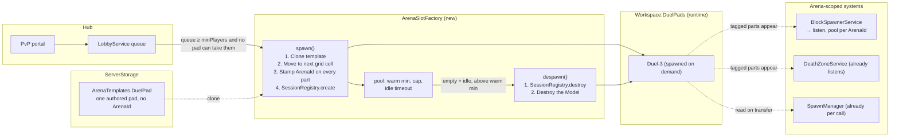
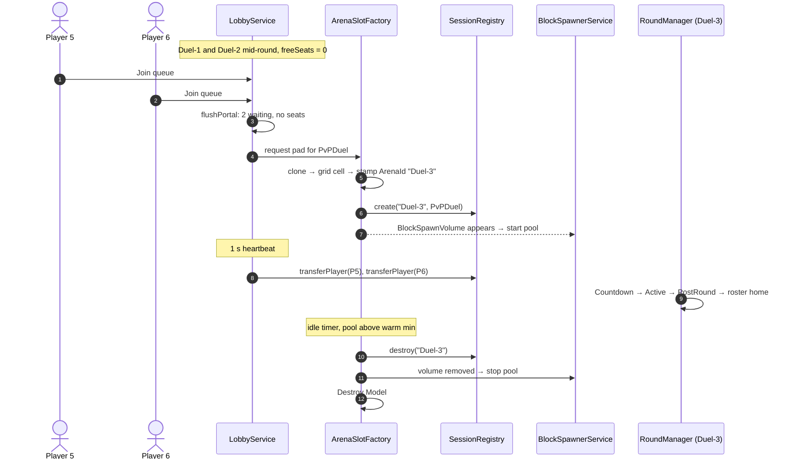
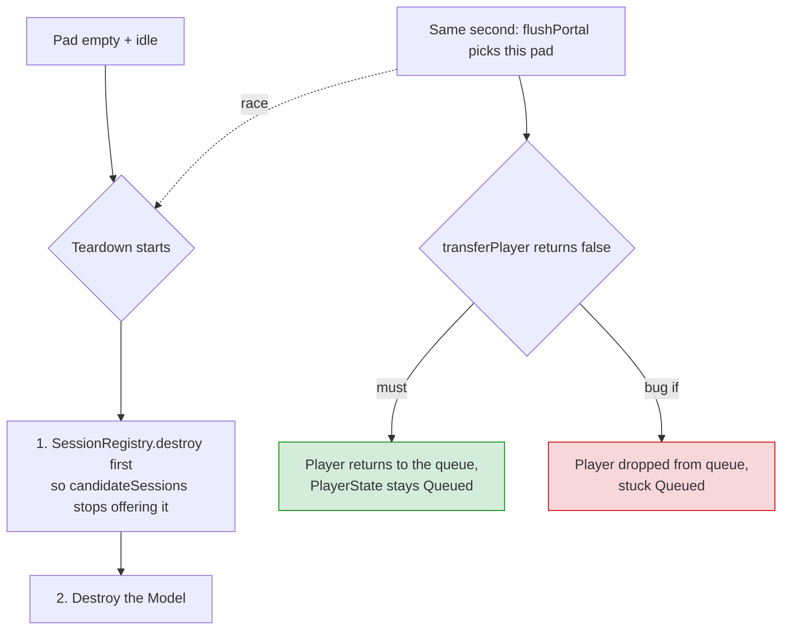
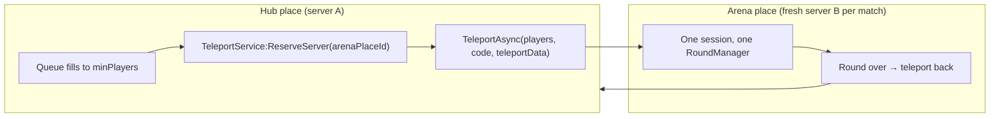

# Arena Instancing — scaling the duel pool

Companion to [[design/lobby]] (stage 6, the pad pool) and [[systems/GameMode]]
(sessions, `ArenaId` scoping). Prompted by the question "if the hub is busy,
should a new duel pad be created so nobody waits?" asked the day after stage 6
shipped. **Decision (user, 2026-09-20): stay single-server with scene-authored
pads for now.** This page exists so the switch, if it ever comes, is a
bounded task rather than a rediscovery.

## The three Roblox patterns

| | Pattern | Who uses it | Trade |
|---|---|---|---|
| 1 | **Reserved match servers** — hub place + `TeleportService:ReserveServer` on an arena place, one fresh server per match | Bedwars, Arsenal ranked, TDS, most big round-based games | No arena count to manage; loading screen each way, second place to publish, state travels as `TeleportData`, untestable in a Studio local server |
| 2 | **Fixed in-server arenas** — several authored arenas, one server, a queue assigns | Smaller PvP games, 1v1 pits, obby races | Simple, memory-resident state; capacity = arena count × roster |
| 3 | **In-server dynamic instancing** — clone a template arena per match, destroy after | Procedural / private-room games | Unbounded capacity on one server; every arena-scoped system gains a runtime add/remove path |

Brain Fighter is pattern 2 as of stage 6. Hosting is free in every pattern —
Roblox spins up and discards servers at no charge — so this is a design and
code decision only.

## Why pattern 2 is enough for now

A duel is two players and roughly three minutes (`DuelKillLimit` /
`DuelTimeLimitMin`). Servers have a fixed max player count set on the place,
so the worst case is *max players ÷ 2* pads — a small, bounded number. Adding
pads is a Studio task: clone `Workspace.DuelPads/Duel1`, give it a new
`ArenaId`, keep the `ArenaSlot` tag and `Mode = PvPDuel`. Blocks, spawns,
death zone and return portal come with it for free (they are all scene-gated
by tag, refactor chunks 2, 9 and 11). The queue already handles any number of
pads (`candidateSessions`, fullest-first).

**Rule to keep the switch cheap:** nothing anywhere names `Duel1` / `Duel2`
by string. The pad count is data. As long as that holds, "more pads" is
twenty minutes in Studio and "cloned pads" is the plan below.

Revisit when a real playtest shows the hub queue backing up, when duels get
long enough that two pads hold the queue for many minutes, or when a mode
with a larger roster arrives.

## What already tolerates a runtime pad

Verified 2026-09-20 against `src/`:

- **Runtime-safe already:** `DeathZoneService` listens on
  `GetInstanceAddedSignal`; `SpawnManager.getSpawnPoints`, `LobbyService.livePortals`
  and `Hittables` re-scan tags per call; `candidateSessions` reads the
  registry live; `SessionRegistry.destroy` exists (the test suites use it).
- **Boot-time only, would break:** `BlockSpawnerService.collectVolumesByArena`
  (one scan, pools built once) and `GameModeService.createSceneSlots` (one
  scan of `ArenaSlot`).

Everything arena-scoped keys off the `ArenaId` attribute via `Arena.idOf`, so
a cloned pad with a fresh id is indistinguishable from an authored one.

## Switch path A — in-server dynamic instancing

### How it would work

### Plan

| Step | Work | Size |
|---|---|---|
| 1 Template | Move one pad to `ServerStorage.ArenaTemplates.DuelPad`; duel pads stop being `ArenaSlot`s and become factory output. Lobby and Default stay code-created. | ½ day, Studio |
| 2 Factory | New `ArenaSlotFactory` in `server/GameMode`: clone, place on a grid stride far from the hub, rewrite `ArenaId` on every descendant carrying the attribute, `SessionRegistry.create`. `despawn` reverses it, registry first. Warm pool of two at boot. | 1 day |
| 3 Blocks | `BlockSpawnerService` → `GetInstanceAddedSignal` / `RemovedSignal` on `BlockSpawnVolume`, lazy pool per arena, `pool:destroy()` on removal clearing in-flight blocks. | ½ day |
| 4 Queue | In `flushPortal`, after the candidate loop: if the queue still holds ≥ the mode's `minPlayers` and the pool is under its cap, request a pad. Heartbeat flushes it next tick. Sign copy: `Capacity` is no longer fixed. | ½ day |
| 5 Teardown | Pad empty and `WaitingForPlayers` longer than the idle timeout, pool above warm minimum → despawn. | ½ day code, most of the risk |
| 6 Tests | Factory spawn/despawn round-trip; lazy block pool; pure "pads needed" rule; `scene_slots_have_sessions` accepts zero duel slots. | ½ day |
| 7 Docs | This page → decision; [[systems/GameMode]], [[systems/Tests]], two-client doc gains spawn/teardown cases. | ½ day |

**Total ≈ 4–5 focused days**, about four stage-6s. New constants: grid
stride, warm minimum, pool cap, idle timeout (a `GameModeConstants` block).
Untouched: `PvPDuel` rules, `RoundManager`, `ScoreTracker`, `RoundOutcomeCopy`,
HUD, round-start heal, portal UI.

### Where the risk sits

Everything keyed by `ArenaId` that can be in flight when the pad vanishes
needs the same care: blocks mid-respawn, a dead player's respawn timer, VFX
anchors, the kill feed's arena filter. This class of bug only shows with real
players, which is the reason not to pay for it before a playtest demands it.

**Ongoing tax:** every future arena-scoped system must handle add *and*
remove, and every suite gains runtime-spawn cases — a few hours per system,
forever.

## Switch path B — reserved match servers

Shape: a new *destination kind* in `LobbyService` — the queue is already
separate from "where they go" (`candidateSessions` is the only function that
knows) — that teleports instead of `transferPlayer`. A second place holding
one session; `RoundManager` and the modes run unchanged there. Loadout and
score state cross as `TeleportData` or DataStore.

**≈ 2 weeks**, mostly because teleports cannot run in a Studio local server,
so every verification cycle goes through a published place. Worth it only for
cross-server ranked matchmaking, rosters bigger than one server seats, or a
boss raid that should not share a server with the hub. A hybrid is common:
local pads for casual duels, a "ranked" portal that teleports.

## What carries to later games

The reusable asset is the session model — `SessionRegistry`, `RoundManager`,
`ArenaId` scoping, the `ArenaSlot` convention and the `LobbyService` queue —
and it is pattern-agnostic. The instancing *policy* is per-game: it depends
on server size, match length and whether cross-server matchmaking is wanted,
so choose it per game against those numbers rather than building it in.
