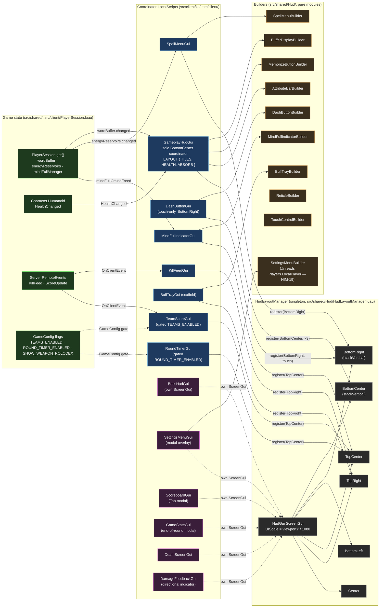

# HUD System

Every HUD element follows the [[concepts/BuilderConfigLayout]] pattern — a Builder constructs the GUI tree, a Config exposes tunable knobs, and `HudLayoutManager` places the result on screen. No `.rbxmx` GUI templates are checked into the repo.

## System diagram

The three layers: pure-module **Builders** in `src/shared/Hud/`, client-side **Coordinator LocalScripts** in `src/client/UI/` that build and register, and **game-state sources** (`PlayerSession`, `Humanoid`, server `RemoteEvent`s). `HudLayoutManager` owns the single `HudGui` ScreenGui and 6 named regions.



Legend: blue = Coordinator LocalScript, orange = pure-module Builder, green = game-state source, purple = modal/own-ScreenGui (bypasses HudLayoutManager), gray = layout region. Solid arrows = mount/register. Dashed arrows = own ScreenGui parented directly to `PlayerGui`.

## Single-ownership invariants (Phase 4.8 audit)

- `GameplayHudGui` is the **sole BottomCenter coordinator**. (The former `LoadoutDropClient` toast stack that shared BottomCenter was removed with the Loadout system in commit `6610291`.)
- Every Builder in `src/shared/Hud/` exposes `:destroy()` (12/12). Health adapter connections are tracked inline in `GameplayHudGui` (`healthConnections` table, cleared on respawn).
- All Builders are pure modules except `SettingsMenuBuilder` (reads `Players.LocalPlayer` — tracked in NIM-19).
- Detailed findings: [[design/ui-architecture-review]].


## Team-score gate (2026-05-13)

`src/client/UI/TeamScoreGui.client.luau` is a top-of-script bail when `GameConfig.TEAMS_ENABLED` is false — the LocalScript still auto-runs on join but exits before building the container or hooking remotes. `KillFeedGui` is left on (NPC kills still display); its team-tinted name colours fall back to `NEUTRAL_NAME_COLOR` naturally because every player is team-less while the gate is off.

## Files

```
src/shared/Hud/
  HudLayoutManager.luau           — places elements at named regions (BottomLeft, BottomRight, TopRight, etc.)
  HudConstants.luau               — shared sizes / colors / margins
  AttributeBarBuilder.luau        — Health / Stamina / Shield bars
  AttributeBarConfig.luau
  BuffTrayBuilder.luau            — top-right buff icons (scaffold)
  BuffIconConfig.luau
  TouchControlBuilder.luau        — mobile touch overlay
  TouchControlConfig.luau
  SettingsMenuBuilder.luau
  SettingsMenuConfig.luau
  -- Phase 4 gameplay widgets:
  BufferDisplayBuilder.luau       — letter-tile row from WordBuffer.tiles()
  BufferDisplayConfig.luau
  ReservoirBarsBuilder.luau       — [unused] R/G/B energy bars; superceded by SpellMenu fill
  ReservoirBarsConfig.luau        — [unused]
  MemorizeButtonBuilder.luau      — Memorize action button (calls MemorizeAction.tryMemorize)
  MemorizeButtonConfig.luau
  SpellMenuBuilder.luau           — 3-color spell panel; buttons fill with mana (bottom→top gradient); tap → CastAction.tapReservoir + energy popup
  SpellMenuConfig.luau
  MindFullIndicatorBuilder.luau   — warning banner when WordBuffer is full
  MindFullIndicatorConfig.luau
  DashButtonBuilder.luau          — mobile dash button (BottomRight vertical column)
  DashButtonConfig.luau

src/client/UI/
  GameplayHudGui.client.luau      — BottomCenter coordinator: single LAYOUT table owns tile/health/ABSORB
                                    stacking order; also owns CharacterAdded → adapter wiring
  DamageFeedbackGui.client.luau   — directional damage indicators
  DeathScreenGui.client.luau      — death overlay
  SettingsMenuGui.client.luau     — settings menu mount
  SpellMenuGui.client.luau        — BottomRight; fires tapReservoir on color tap; drives fill via energyReservoirs.changed
  DashButtonGui.client.luau       — BottomRight vertical column (touch-only); tap → _G.BrainFighter.requestDash()
  MindFullIndicatorGui.client.luau — TopCenter; shows/hides on mindFull/mindFreed
  BossHudGui.client.luau          — own ScreenGui (IgnoreGuiInset=true, y=8); boss health bar + phase label; hidden until a boss spawns
  RoundTimerGui.client.luau       — TopCenter; round state + formatted timer; gated behind GameConfig.ROUND_TIMER_ENABLED (currently false)
```

## Phase 4 gameplay widgets

The first four read state through `PlayerSession.get()` and subscribe to signals from the session objects. DashButton is a mobile-only input control (no session signal).

| Widget | Region | Signal source | Action |
|---|---|---|---|
| BufferDisplay | BottomCenter | `wordBuffer.changed` | display tiles |
| MemorizeButton | BottomCenter | `wordBuffer.changed` | `MemorizeAction.tryMemorize` |
| SpellMenu | BottomRight | `energyReservoirs.changed` | gradient fill + `CastAction.tapReservoir`; tap shows energy popup |
| MindFullIndicator | TopCenter | `mindFull` / `mindFreed` | show/hide warning |
| DashButton | BottomRight | `InputCategorizer` (touch toggle) | tap → `_G.BrainFighter.requestDash()` (mobile-only, hidden on KBM) |

## Health bar wiring

`GameplayHudGui` builds the health bar directly via `AttributeBarBuilder.build({name="Health", ...})` and maintains a `healthConnections` table of `RBXScriptConnection`s. On each `CharacterAdded` it disconnects old connections and re-subscribes to the new character's `Humanoid.HealthChanged` and `Humanoid.MaxHealthChanged`. No separate Adapter module.

## WeaponRolodex — REMOVED (2026-06-22, commit `6610291`)

The weapon-cycling card widget (Builder + Config + `WeaponRolodexGui` coordinator) was removed with the TPS weapon stack — Brain Fighter equips the single [[systems/LetterBlaster]] Spelling Staff, so there is nothing to cycle. The former `SHOW_WEAPON_ROLODEX` gate and the `_ammo` / `WeaponIcon` / `_cooldownEnd` Tool-attribute reads no longer apply.

## Reticle

White `+` crosshair, red `X` hitmarker (CanvasGroup with a Rotation quirk — fade via `Visible = false` at completion, not transparency tween). Reactive spread: shot bumps spread, Heartbeat decays it back.

## Cross-references

- Pattern → [[concepts/BuilderConfigLayout]]
- Weapon icons (asset pipeline) → `reference_weapon_icon_pipeline.md` in auto-memory
