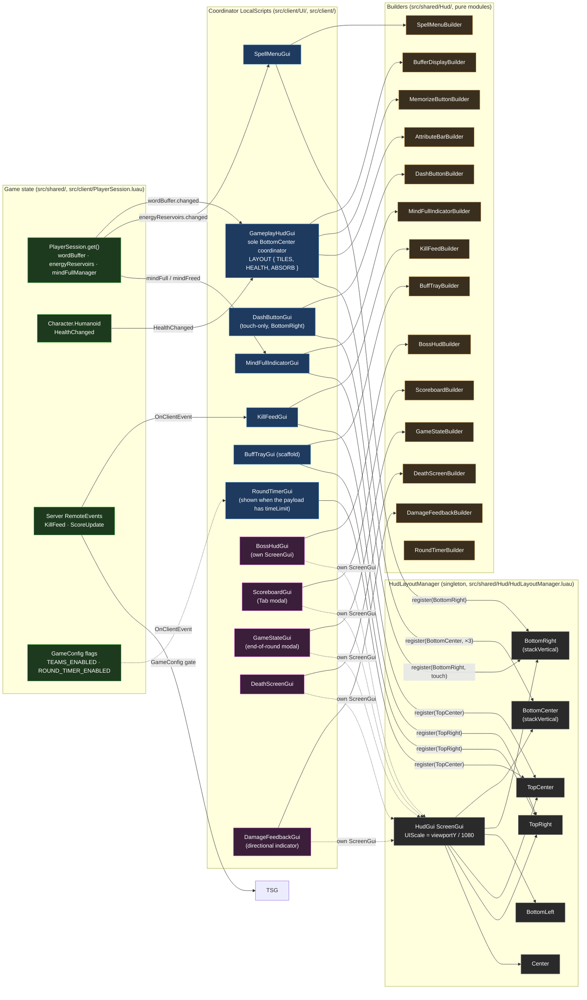

# HUD System

Every HUD element follows the [[concepts/BuilderConfigLayout]] pattern — a Builder constructs the GUI tree, a Config exposes tunable knobs, and `HudLayoutManager` places the result on screen. No `.rbxmx` GUI templates are checked into the repo.

## System diagram

The three layers: pure-module **Builders** in `src/shared/Hud/`, client-side **Coordinator LocalScripts** in `src/client/UI/` that build and register, and **game-state sources** (`PlayerSession`, `Humanoid`, server `RemoteEvent`s). `HudLayoutManager` owns the single `HudGui` ScreenGui and 6 named regions.


```mermaid
flowchart LR
  classDef coord fill:#1e3a5f,stroke:#5a9fd4,color:#fff
  classDef builder fill:#3a2f1e,stroke:#d4a05a,color:#fff
  classDef state fill:#1e3a1e,stroke:#5fd45a,color:#fff
  classDef region fill:#2a2a2a,stroke:#888,color:#fff
  classDef modal fill:#3a1e3a,stroke:#d45ad4,color:#fff

  subgraph SRC["Game state (src/shared/, src/client/PlayerSession.luau)"]
    PS["PlayerSession.get()<br/>wordBuffer · energyReservoirs · mindFullManager"]:::state
    HUM["Character.Humanoid<br/>HealthChanged"]:::state
    REM["Server RemoteEvents<br/>KillFeed · ScoreUpdate"]:::state
    CFG["GameConfig flags<br/>TEAMS_ENABLED · ROUND_TIMER_ENABLED"]:::state
  end

  subgraph LM["HudLayoutManager (singleton, src/shared/Hud/HudLayoutManager.luau)"]
    HM["HudGui ScreenGui<br/>UIScale = viewportY / 1080"]:::region
    BC["BottomCenter<br/>(stackVertical)"]:::region
    BR["BottomRight<br/>(stackVertical)"]:::region
    BL["BottomLeft"]:::region
    TC["TopCenter"]:::region
    TR["TopRight"]:::region
    CN["Center"]:::region
    HM --> BC & BR & BL & TC & TR & CN
  end

  subgraph COORD["Coordinator LocalScripts (src/client/UI/, src/client/)"]
    GHUD["GameplayHudGui<br/>sole BottomCenter coordinator<br/>LAYOUT { TILES, HEALTH, ABSORB }"]:::coord
    SMG["SpellMenuGui"]:::coord
    DBG["DashButtonGui<br/>(touch-only, BottomRight)"]:::coord
    MFI["MindFullIndicatorGui"]:::coord
    KFG["KillFeedGui"]:::coord
    BTG["BuffTrayGui (scaffold)"]:::coord
    RTG["RoundTimerGui<br/>(shown when the payload has timeLimit)"]:::coord
    BHG["BossHudGui<br/>(own ScreenGui)"]:::modal
    SBG["ScoreboardGui<br/>(Tab modal)"]:::modal
    GSG["GameStateGui<br/>(end-of-round modal)"]:::modal
    DSG["DeathScreenGui"]:::modal
    DFG["DamageFeedbackGui<br/>(directional indicator)"]:::modal
  end

  subgraph BLD["Builders (src/shared/Hud/, pure modules)"]
    ABB["AttributeBarBuilder"]:::builder
    BDB["BufferDisplayBuilder"]:::builder
    MBB["MemorizeButtonBuilder"]:::builder
    SMB["SpellMenuBuilder"]:::builder
    MFB["MindFullIndicatorBuilder"]:::builder
    DBB["DashButtonBuilder"]:::builder
    BTB["BuffTrayBuilder"]:::builder
    DSB["DeathScreenBuilder"]:::builder
    DAFB["DamageFeedbackBuilder"]:::builder
    GSB["GameStateBuilder"]:::builder
    SCB["ScoreboardBuilder"]:::builder
    BHB["BossHudBuilder"]:::builder
    KFB["KillFeedBuilder"]:::builder
    RTB["RoundTimerBuilder"]:::builder
  end

  %% --- coordinator → builder ---
  GHUD --> BDB & MBB & ABB
  SMG --> SMB
  DBG --> DBB
  MFI --> MFB
  BTG --> BTB
  DSG --> DSB
  DFG --> DAFB
  GSG --> GSB
  SBG --> SCB
  BHG --> BHB
  KFG --> KFB

  %% --- coordinator → HudLayoutManager region ---
  GHUD -- "register(BottomCenter, ×3)" --> BC
  SMG -- "register(BottomRight)" --> BR
  MFI -- "register(TopCenter)" --> TC
  KFG -- "register(TopRight)" --> TR
  BTG -- "register(TopRight)" --> TR
  RTG -- "register(TopCenter)" --> TC
  DBG -- "register(BottomRight, touch)" --> BR

  %% --- modal / own-ScreenGui (bypass HudLayoutManager) ---
  BHG -.->|own ScreenGui| HM
  SBG -.->|own ScreenGui| HM
  GSG -.->|own ScreenGui| HM
  DSG -.->|own ScreenGui| HM
  DFG -.->|own ScreenGui| HM

  %% --- state → coordinator (signals) ---
  PS -- "wordBuffer.changed" --> GHUD
  PS -- "energyReservoirs.changed" --> SMG
  PS -- "mindFull / mindFreed" --> MFI
  HUM -- "HealthChanged" --> GHUD
  REM -- "OnClientEvent" --> KFG & TSG
  CFG -. "GameConfig gate" .-> RTG
```

Legend: blue = Coordinator LocalScript, orange = pure-module Builder, green = game-state source, purple = modal/own-ScreenGui (bypasses HudLayoutManager), gray = layout region. Solid arrows = mount/register. Dashed arrows = own ScreenGui parented directly to `PlayerGui`.

## Single-ownership invariants (Phase 4.8 audit)

- `GameplayHudGui` is the **sole BottomCenter coordinator**. (The former `LoadoutDropClient` toast stack that shared BottomCenter was removed with the Loadout system in commit `6610291`.)
- Every Builder in `src/shared/Hud/` exposes `:destroy()`. Health adapter connections are tracked inline in `GameplayHudGui` (`healthConnections` table, cleared on respawn).
- All Builders are pure modules — no client globals, no self-parenting. (`SettingsMenuBuilder` was the one exception; cut in refactor chunk 12 along with the rest of the settings menu.)
- Detailed findings: [[design/ui-architecture-review]].
- **A gated element never writes its own gated property** — see
  [[concepts/HudGate]] § Owners never write the gated property. Added as
  refactor chunk 3 after F4; the gate warns when it catches a violation.

## The dash bridge — `client/DashApi` (2026-09-08, refactor chunk 3)

`DashManager` owns a `DashController` that is destroyed and rebuilt on every
respawn; `DashButtonGui` needs to trigger a dash without holding a reference to
whichever controller is current. That indirection used to be a `_G` slot
(`_G.BrainFighter.requestDash`), which nothing typed and nothing could find.

It is now `src/client/DashApi.luau`, a ModuleScript under
`StarterPlayerScripts.Client` that both LocalScripts require:

```
DashManager.client.luau  → DashApi.setProvider(fn)   -- closes over activeController
DashButtonGui.client.luau → DashApi.requestDash()    -- returns false if unregistered
```

Registration order does not matter: the provider is resolved at request time,
not at require time, so a UI script that loads first still works on the first
tap. `requestDash` returning `false` is what lets `DashButtonGui` log a real
warning instead of failing silently the way the `_G` lookup did.

The other five `_G.PlayerHud.*` writes (`BuffTray`, `DashButton`,
`BufferDisplay`, `MemorizeButton`, `AttributeStack`, `MindFullIndicator`,
`SpellMenu`) were **deleted rather than ported** — a grep of `src/` found no
readers for any of them. A future BuffAdapter should get a named seam like
`DashApi`, not a global.

## TopRight stacks (2026-09-08, refactor chunk 3)

`TopRight` had two occupants — `KillFeedGui`'s container and `BuffTrayGui`'s
tray — and no layout, so both sat at the region's top-right corner and drew
over each other. The region now carries `stackVertical = true` with
`stackPadding = 8` in `HudConstants`.

Order is by `LayoutOrder`: `KillFeedGui` leaves it at the default `0` so the
feed keeps exactly the position it always had, and the tray declares
`BuffIconConfig.LAYOUT_ORDER = 1` to sit underneath it. The tray's container
was also switched to `AutomaticSize.XY` with a zero authored size —
`AutomaticSize` treats the authored `Size` as a *minimum*, so the old
`ICON_SIZE`-tall frame would have reserved a row in the new stack and pushed
the kill feed down even with no buffs active. An empty tray now measures
0 × 0 and the feed does not move.

## Own-ScreenGui elements ported to Builder+Config (2026-09-15, refactor chunk 12)

`DeathScreenGui`, `DamageFeedbackGui`, `GameStateGui`, `ScoreboardGui`, `BossHudGui` and `KillFeedGui` used to build their DOM by hand inline in the coordinator LocalScript (F24). Each now has a `<Name>Builder.luau` / `<Name>Config.luau` pair in `src/shared/Hud/`, same split as every other HUD element: the Builder returns a handle of setter methods (`show`/`hide`/`setScores`/`addEntry`/…), the coordinator owns remote wiring and calls the handle, the Config holds every color/size/font literal that used to be inline.

Two things changed that are specific to this batch, because five of the six (all but `KillFeedGui`) parent their own `ScreenGui` instead of registering into a `HudLayoutManager` region:

- **`DisplayOrder` literals → `HudConstants.LAYERS`.** The five per-file numbers (15/20/25/30, with two files sharing 15 and two sharing 30) are now named tiers — `Overlay` (`BossHudGui`), `Feedback` (`DamageFeedbackGui`), `Scoreboard` (`ScoreboardGui`), `Modal` (`GameStateGui`, `DeathScreenGui`) — alongside the shared `HudGui`'s own `Hud` tier. `RoundTimerGui` (not ported this chunk, still hand-built) also switched its literal to `LAYERS.Overlay` since it shared the same visual tier and the chunk's done-condition was "no literal `DisplayOrder` left in `src/client/UI`".
- **No `UIScale` → `HudLayoutManager:attachScale(screenGui)`.** These five ScreenGuis never scaled with `HudConstants.REFERENCE_HEIGHT` the way region-registered elements do (`HudLayoutManager` only ever built one `UIScale`, on its own `HudGui`). `attachScale` creates a second `UIScale` on the caller's `ScreenGui` and keeps it driven by the same `viewportY / REFERENCE_HEIGHT` formula — one formula, two `UIScale` instances, still one owner (`HudLayoutManager`).

`KillFeedGui` was ported for the same reason (F24 named all six) but was never own-ScreenGui — it registers a `Frame` into `HudLayoutManager`'s `TopRight` region and already inherited the shared `HudGui`'s `UIScale`. Its port is a straight Builder+Config extraction with no `DisplayOrder` or scale changes.

**`RoundTimerGui` followed on 2026-09-19 (Phase 6 stage 6)** — `RoundTimerBuilder` / `RoundTimerConfig`, a handle of `setVisible` / `showWaiting` / `showCountdown` / `showActive` / `showPostRound`, and `attachScale` like its siblings. Nothing in `src/client/UI` builds its DOM by hand any more.

**Round-over copy is keyed by outcome, not by winner presence.** The PostRound payload carries `outcome` (a `GameModeConstants.RoundOutcome` id — see [[systems/GameMode]]). `Hud/RoundOutcomeCopy` is the one table that turns it into words: title (`BOSS DEFEATED`, `OPPONENT LEFT`, `DUEL OVER`, `TIME'S UP`) and the no-winner line (`The boss is down`, `The boss survives`, `Draw`). `GameStateBuilder.setOutcome(outcome, winnerName)` replaced `setWinner`, and `RoundTimerBuilder.showPostRound` reads the same module, so the card and the strip cannot disagree. Before this a boss kill read "No winner".

The gate-owner rule is unaffected: `DeathScreenGui`'s `DeathScreenBuilder` still drives `overlay.Visible` from `show`/`hide`, never the `ScreenGui.Enabled` that `HudGate.bindScreenGui` owns (see [[concepts/HudGate]] § Owners never write the gated property) — that split just moved from the old inline script into the Builder's closure.

## Settings — REBUILT (2026-09-20, BRA.21)

A new surface, not the old one restored: `SettingsGui` (gear button in the `TopRight` stack + a panel at `LAYERS.Modal`, both **`LobbyOnly`** — the first users of that policy), `SettingsBuilder` + `SettingsConfig`, three settings that each have a reader (SFX volume via a `SoundGroup`, Reduced effects read by `spawnEffect`/`ScreenImpact`, letter palette through `Colors.tint`). Own page: [[systems/Settings]]. The cut below is the history.

## Settings menu — CUT (2026-09-15, refactor chunk 12, F25/Q5(a))

`SettingsMenuGui.client.luau`, `SettingsMenuBuilder.luau` and `SettingsMenuConfig.luau` are deleted, along with the `P` keybind. The menu wrote `Settings_*` player attributes (sensitivity, FOV, crosshair color, aim assist) that nothing ever read — the intended crosshair consumer, `ReticleBuilder`, has zero requirers and was already dead code (see § Reticle / TouchControl below). Tracker BRA.21 (local key) tracks building a real settings surface when one is needed.

## Team-score gate — REMOVED (2026-09-08, refactor chunk 0)

`src/client/UI/TeamScoreGui.client.luau` used to be a top-of-script bail when `GameConfig.TEAMS_ENABLED` is false — the LocalScript still auto-ran on join but exited before building the container or hooking remotes. Deleted as dead code: `TEAMS_ENABLED` has read `false` since the Archon team/PvP template was cut in `6610291`, and `GameConfig`'s comment now says flipping it no longer restores anything (the mode files are gone). `KillFeedGui` still displays NPC kills unaffected; its team-tinted name colours fall back to `NEUTRAL_NAME_COLOR` since every player is team-less.

## Files

```
src/shared/Hud/
  HudLayoutManager.luau           — places elements at named regions (BottomLeft, BottomRight, TopRight, etc.)
  HudConstants.luau               — shared sizes / colors / margins
  AttributeBarBuilder.luau        — Health / Stamina / Shield bars
  AttributeBarConfig.luau
  BuffTrayBuilder.luau            — top-right buff icons (scaffold)
  BuffIconConfig.luau
  SettingsBuilder.luau            — settings panel + gear button (2026-09-20, LobbyOnly)
  SettingsConfig.luau
  -- Own-ScreenGui elements (refactor chunk 12):
  DeathScreenBuilder.luau         — death overlay + respawn countdown
  DeathScreenConfig.luau
  DamageFeedbackBuilder.luau      — full-screen damage flash
  DamageFeedbackConfig.luau
  GameStateBuilder.luau           — end-of-round results overlay (outcome title + winner line + top players)
  GameStateConfig.luau
  RoundTimerBuilder.luau          — top-centre round state / timer strip (stage 6 port)
  RoundTimerConfig.luau
  RoundOutcomeCopy.luau           — RoundOutcome id → card title / no-winner line; shared by GameState + RoundTimer builders
  ScoreboardBuilder.luau          — Tab-to-open scoreboard
  ScoreboardConfig.luau
  BossHudBuilder.luau             — boss health bar + phase label
  BossHudConfig.luau
  KillFeedBuilder.luau            — top-right kill feed strip (registers into TopRight, not own ScreenGui)
  KillFeedConfig.luau
  -- Phase 4 gameplay widgets:
  BufferDisplayBuilder.luau       — letter-tile row from WordBuffer.tiles()
  BufferDisplayConfig.luau
  MemorizeButtonBuilder.luau      — Memorize action button (calls MemorizeAction.tryMemorize)
  MemorizeButtonConfig.luau
  SpellMenuBuilder.luau           — 3-color circular spell panels; mana fills outward from the centre,
                                    tier thresholds are concentric rings, numeral in the middle;
                                    a rim halo breathes and motes orbit while the panel can cast;
                                    press-hold-release charges a tier (see [[systems/ChargeCast]])
  SpellMenuConfig.luau
  MindFullIndicatorBuilder.luau   — warning banner when WordBuffer is full
  MindFullIndicatorConfig.luau
  DashButtonBuilder.luau          — mobile dash button (BottomRight vertical column)
  DashButtonConfig.luau

src/client/UI/
  GameplayHudGui.client.luau      — BottomCenter coordinator: single LAYOUT table owns tile/health/ABSORB
                                    stacking order; also owns CharacterAdded → adapter wiring
  DamageFeedbackGui.client.luau   — directional damage indicators; own ScreenGui at HudConstants.LAYERS.Feedback
  DeathScreenGui.client.luau      — death overlay; own ScreenGui at HudConstants.LAYERS.Modal
  SpellMenuGui.client.luau        — BottomRight; consumes the builder's charge signals, drives the local
                                    charge orb + the ChargeState relay, forwards castRequested to
                                    client/SpellCastController (RequestCast BindableFunction) and plays
                                    the fired flash / fizzle from its result; fill via
                                    energyReservoirs.changed. Target resolution + castSpecific + the
                                    SpellCastServer relay left the HUD in refactor chunk 7 (audit F21)
  DashButtonGui.client.luau       — BottomRight vertical column (touch-only); tap → DashApi.requestDash()
  MindFullIndicatorGui.client.luau — TopCenter; shows/hides on mindFull/mindFreed
  BossHudGui.client.luau          — own ScreenGui (IgnoreGuiInset=true, LAYERS.Overlay); boss health bar + phase label; hidden until a boss spawns
  RoundTimerGui.client.luau       — coordinator for RoundTimerBuilder; own ScreenGui at HudConstants.LAYERS.Overlay; strip visible only while the payload carries timeLimit
  GameStateGui.client.luau        — own ScreenGui at HudConstants.LAYERS.Modal; end-of-round results overlay
  ScoreboardGui.client.luau       — own ScreenGui at HudConstants.LAYERS.Scoreboard; Y toggles the Tab-style panel
  KillFeedGui.client.luau         — TopRight coordinator; forwards KillFeed remote entries to KillFeedBuilder
```

## Phase 4 gameplay widgets

The first four read state through `PlayerSession.get()` and subscribe to signals from the session objects. DashButton is a mobile-only input control (no session signal).

| Widget | Region | Signal source | Action |
|---|---|---|---|
| BufferDisplay | BottomCenter | `wordBuffer.changed` | display tiles |
| MemorizeButton | BottomCenter | `wordBuffer.changed` | `MemorizeAction.tryMemorize` |
| SpellMenu | BottomRight | `energyReservoirs.changed` | circular panels — centre-out fill + concentric tier rings + centred numeral + a ready halo and orbiting motes while castable; press-hold-release → `CastAction.castSpecific` at the charged tier ([[systems/ChargeCast]]) |
| MindFullIndicator | TopCenter | `mindFull` / `mindFreed` | show/hide warning |
| DashButton | BottomRight | `InputCategorizer` (touch toggle) | tap → `DashApi.requestDash()` (mobile-only, hidden on KBM) |

## Health bar wiring

`GameplayHudGui` builds the health bar directly via `AttributeBarBuilder.build({name="Health", ...})` and maintains a `healthConnections` table of `RBXScriptConnection`s. On each `CharacterAdded` it disconnects old connections and re-subscribes to the new character's `Humanoid.HealthChanged` and `Humanoid.MaxHealthChanged`. No separate Adapter module.

## WeaponRolodex — REMOVED (2026-06-22, commit `6610291`)

The weapon-cycling card widget (Builder + Config + `WeaponRolodexGui` coordinator) was removed with the TPS weapon stack. Brain Fighter then equipped a single Tool (the [[systems/LetterBlaster]] Spelling Staff), and since Phase 5.7 equips nothing at all — blocks are tapped directly — so there has never been anything to cycle. The former `SHOW_WEAPON_ROLODEX` gate and the `_ammo` / `WeaponIcon` / `_cooldownEnd` Tool-attribute reads no longer apply.

## Reticle / TouchControl — REMOVED (2026-09-08, refactor chunk 0)

`ReticleBuilder`/`ReticleConfig` (white `+` crosshair, red `X` hitmarker) and `TouchControlBuilder`/`TouchControlConfig` (mobile touch overlay) were dead code — grep found zero requires of any of the four modules anywhere in `src/`, and no coordinator LocalScript ever built or registered them. Deleted rather than kept as unused scaffolding. Aiming feedback is currently `DamageFeedbackGui`'s directional indicator only; there is no crosshair or mobile touch overlay in the HUD today.

## Cross-references

- Pattern → [[concepts/BuilderConfigLayout]]
- Weapon icons (asset pipeline) → `reference_weapon_icon_pipeline.md` in auto-memory
