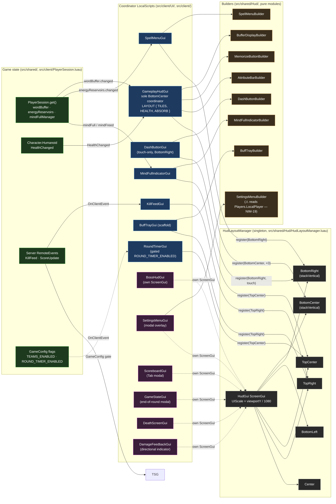

# HUD System

Every HUD element follows the [[concepts/BuilderConfigLayout]] pattern — a Builder constructs the GUI tree, a Config exposes tunable knobs, and `HudLayoutManager` places the result on screen. No `.rbxmx` GUI templates are checked into the repo.

## System diagram

The three layers: pure-module **Builders** in `src/shared/Hud/`, client-side **Coordinator LocalScripts** in `src/client/UI/` that build and register, and **game-state sources** (`PlayerSession`, `Humanoid`, server `RemoteEvent`s). `HudLayoutManager` owns the single `HudGui` ScreenGui and 6 named regions.


```mermaid
flowchart LR
  classDef coord fill:#1e3a5f,stroke:#5a9fd4,color:#fff
  classDef builder fill:#3a2f1e,stroke:#d4a05a,color:#fff
  classDef state fill:#1e3a1e,stroke:#5fd45a,color:#fff
  classDef region fill:#2a2a2a,stroke:#888,color:#fff
  classDef modal fill:#3a1e3a,stroke:#d45ad4,color:#fff

  subgraph SRC["Game state (src/shared/, src/client/PlayerSession.luau)"]
    PS["PlayerSession.get()<br/>wordBuffer · energyReservoirs · mindFullManager"]:::state
    HUM["Character.Humanoid<br/>HealthChanged"]:::state
    REM["Server RemoteEvents<br/>KillFeed · ScoreUpdate"]:::state
    CFG["GameConfig flags<br/>TEAMS_ENABLED · ROUND_TIMER_ENABLED"]:::state
  end

  subgraph LM["HudLayoutManager (singleton, src/shared/Hud/HudLayoutManager.luau)"]
    HM["HudGui ScreenGui<br/>UIScale = viewportY / 1080"]:::region
    BC["BottomCenter<br/>(stackVertical)"]:::region
    BR["BottomRight<br/>(stackVertical)"]:::region
    BL["BottomLeft"]:::region
    TC["TopCenter"]:::region
    TR["TopRight"]:::region
    CN["Center"]:::region
    HM --> BC & BR & BL & TC & TR & CN
  end

  subgraph COORD["Coordinator LocalScripts (src/client/UI/, src/client/)"]
    GHUD["GameplayHudGui<br/>sole BottomCenter coordinator<br/>LAYOUT { TILES, HEALTH, ABSORB }"]:::coord
    SMG["SpellMenuGui"]:::coord
    DBG["DashButtonGui<br/>(touch-only, BottomRight)"]:::coord
    MFI["MindFullIndicatorGui"]:::coord
    KFG["KillFeedGui"]:::coord
    BTG["BuffTrayGui (scaffold)"]:::coord
    RTG["RoundTimerGui<br/>(gated ROUND_TIMER_ENABLED)"]:::coord
    BHG["BossHudGui<br/>(own ScreenGui)"]:::modal
    SMGUI["SettingsMenuGui<br/>(modal overlay)"]:::modal
    SBG["ScoreboardGui<br/>(Tab modal)"]:::modal
    GSG["GameStateGui<br/>(end-of-round modal)"]:::modal
    DSG["DeathScreenGui"]:::modal
    DFG["DamageFeedbackGui<br/>(directional indicator)"]:::modal
  end

  subgraph BLD["Builders (src/shared/Hud/, pure modules)"]
    ABB["AttributeBarBuilder"]:::builder
    BDB["BufferDisplayBuilder"]:::builder
    MBB["MemorizeButtonBuilder"]:::builder
    SMB["SpellMenuBuilder"]:::builder
    MFB["MindFullIndicatorBuilder"]:::builder
    DBB["DashButtonBuilder"]:::builder
    BTB["BuffTrayBuilder"]:::builder
    STB["SettingsMenuBuilder<br/>(⚠ reads Players.LocalPlayer — NIM-19)"]:::builder
  end

  %% --- coordinator → builder ---
  GHUD --> BDB & MBB & ABB
  SMG --> SMB
  DBG --> DBB
  MFI --> MFB
  BTG --> BTB
  SMGUI --> STB

  %% --- coordinator → HudLayoutManager region ---
  GHUD -- "register(BottomCenter, ×3)" --> BC
  SMG -- "register(BottomRight)" --> BR
  MFI -- "register(TopCenter)" --> TC
  KFG -- "register(TopRight)" --> TR
  BTG -- "register(TopRight)" --> TR
  RTG -- "register(TopCenter)" --> TC
  DBG -- "register(BottomRight, touch)" --> BR

  %% --- modal / own-ScreenGui (bypass HudLayoutManager) ---
  BHG -.->|own ScreenGui| HM
  SMGUI -.->|own ScreenGui| HM
  SBG -.->|own ScreenGui| HM
  GSG -.->|own ScreenGui| HM
  DSG -.->|own ScreenGui| HM
  DFG -.->|own ScreenGui| HM

  %% --- state → coordinator (signals) ---
  PS -- "wordBuffer.changed" --> GHUD
  PS -- "energyReservoirs.changed" --> SMG
  PS -- "mindFull / mindFreed" --> MFI
  HUM -- "HealthChanged" --> GHUD
  REM -- "OnClientEvent" --> KFG & TSG
  CFG -. "GameConfig gate" .-> RTG
```

Legend: blue = Coordinator LocalScript, orange = pure-module Builder, green = game-state source, purple = modal/own-ScreenGui (bypasses HudLayoutManager), gray = layout region. Solid arrows = mount/register. Dashed arrows = own ScreenGui parented directly to `PlayerGui`.

## Single-ownership invariants (Phase 4.8 audit)

- `GameplayHudGui` is the **sole BottomCenter coordinator**. (The former `LoadoutDropClient` toast stack that shared BottomCenter was removed with the Loadout system in commit `6610291`.)
- Every Builder in `src/shared/Hud/` exposes `:destroy()` (12/12). Health adapter connections are tracked inline in `GameplayHudGui` (`healthConnections` table, cleared on respawn).
- All Builders are pure modules except `SettingsMenuBuilder` (reads `Players.LocalPlayer` — tracked in NIM-19).
- Detailed findings: [[design/ui-architecture-review]].
- **A gated element never writes its own gated property** — see
  [[concepts/HudGate]] § Owners never write the gated property. Added as
  refactor chunk 3 after F4; the gate warns when it catches a violation.

## The dash bridge — `client/DashApi` (2026-09-08, refactor chunk 3)

`DashManager` owns a `DashController` that is destroyed and rebuilt on every
respawn; `DashButtonGui` needs to trigger a dash without holding a reference to
whichever controller is current. That indirection used to be a `_G` slot
(`_G.BrainFighter.requestDash`), which nothing typed and nothing could find.

It is now `src/client/DashApi.luau`, a ModuleScript under
`StarterPlayerScripts.Client` that both LocalScripts require:

```
DashManager.client.luau  → DashApi.setProvider(fn)   -- closes over activeController
DashButtonGui.client.luau → DashApi.requestDash()    -- returns false if unregistered
```

Registration order does not matter: the provider is resolved at request time,
not at require time, so a UI script that loads first still works on the first
tap. `requestDash` returning `false` is what lets `DashButtonGui` log a real
warning instead of failing silently the way the `_G` lookup did.

The other five `_G.PlayerHud.*` writes (`BuffTray`, `DashButton`,
`BufferDisplay`, `MemorizeButton`, `AttributeStack`, `MindFullIndicator`,
`SpellMenu`) were **deleted rather than ported** — a grep of `src/` found no
readers for any of them. A future BuffAdapter should get a named seam like
`DashApi`, not a global.

## TopRight stacks (2026-09-08, refactor chunk 3)

`TopRight` had two occupants — `KillFeedGui`'s container and `BuffTrayGui`'s
tray — and no layout, so both sat at the region's top-right corner and drew
over each other. The region now carries `stackVertical = true` with
`stackPadding = 8` in `HudConstants`.

Order is by `LayoutOrder`: `KillFeedGui` leaves it at the default `0` so the
feed keeps exactly the position it always had, and the tray declares
`BuffIconConfig.LAYOUT_ORDER = 1` to sit underneath it. The tray's container
was also switched to `AutomaticSize.XY` with a zero authored size —
`AutomaticSize` treats the authored `Size` as a *minimum*, so the old
`ICON_SIZE`-tall frame would have reserved a row in the new stack and pushed
the kill feed down even with no buffs active. An empty tray now measures
0 × 0 and the feed does not move.

## Team-score gate — REMOVED (2026-09-08, refactor chunk 0)

`src/client/UI/TeamScoreGui.client.luau` used to be a top-of-script bail when `GameConfig.TEAMS_ENABLED` is false — the LocalScript still auto-ran on join but exited before building the container or hooking remotes. Deleted as dead code: `TEAMS_ENABLED` has read `false` since the Archon team/PvP template was cut in `6610291`, and `GameConfig`'s comment now says flipping it no longer restores anything (the mode files are gone). `KillFeedGui` still displays NPC kills unaffected; its team-tinted name colours fall back to `NEUTRAL_NAME_COLOR` since every player is team-less.

## Files

```
src/shared/Hud/
  HudLayoutManager.luau           — places elements at named regions (BottomLeft, BottomRight, TopRight, etc.)
  HudConstants.luau               — shared sizes / colors / margins
  AttributeBarBuilder.luau        — Health / Stamina / Shield bars
  AttributeBarConfig.luau
  BuffTrayBuilder.luau            — top-right buff icons (scaffold)
  BuffIconConfig.luau
  SettingsMenuBuilder.luau
  SettingsMenuConfig.luau
  -- Phase 4 gameplay widgets:
  BufferDisplayBuilder.luau       — letter-tile row from WordBuffer.tiles()
  BufferDisplayConfig.luau
  MemorizeButtonBuilder.luau      — Memorize action button (calls MemorizeAction.tryMemorize)
  MemorizeButtonConfig.luau
  SpellMenuBuilder.luau           — 3-color circular spell panels; mana fills outward from the centre,
                                    tier thresholds are concentric rings, numeral in the middle;
                                    a rim halo breathes and motes orbit while the panel can cast;
                                    press-hold-release charges a tier (see [[systems/ChargeCast]])
  SpellMenuConfig.luau
  MindFullIndicatorBuilder.luau   — warning banner when WordBuffer is full
  MindFullIndicatorConfig.luau
  DashButtonBuilder.luau          — mobile dash button (BottomRight vertical column)
  DashButtonConfig.luau

src/client/UI/
  GameplayHudGui.client.luau      — BottomCenter coordinator: single LAYOUT table owns tile/health/ABSORB
                                    stacking order; also owns CharacterAdded → adapter wiring
  DamageFeedbackGui.client.luau   — directional damage indicators
  DeathScreenGui.client.luau      — death overlay
  SettingsMenuGui.client.luau     — settings menu mount
  SpellMenuGui.client.luau        — BottomRight; consumes the builder's charge signals, drives the local
                                    charge orb + the ChargeState relay, forwards castRequested to
                                    client/SpellCastController (RequestCast BindableFunction) and plays
                                    the fired flash / fizzle from its result; fill via
                                    energyReservoirs.changed. Target resolution + castSpecific + the
                                    SpellCastServer relay left the HUD in refactor chunk 7 (audit F21)
  DashButtonGui.client.luau       — BottomRight vertical column (touch-only); tap → DashApi.requestDash()
  MindFullIndicatorGui.client.luau — TopCenter; shows/hides on mindFull/mindFreed
  BossHudGui.client.luau          — own ScreenGui (IgnoreGuiInset=true, y=8); boss health bar + phase label; hidden until a boss spawns
  RoundTimerGui.client.luau       — TopCenter; round state + formatted timer; gated behind GameConfig.ROUND_TIMER_ENABLED (currently false)
```

## Phase 4 gameplay widgets

The first four read state through `PlayerSession.get()` and subscribe to signals from the session objects. DashButton is a mobile-only input control (no session signal).

| Widget | Region | Signal source | Action |
|---|---|---|---|
| BufferDisplay | BottomCenter | `wordBuffer.changed` | display tiles |
| MemorizeButton | BottomCenter | `wordBuffer.changed` | `MemorizeAction.tryMemorize` |
| SpellMenu | BottomRight | `energyReservoirs.changed` | circular panels — centre-out fill + concentric tier rings + centred numeral + a ready halo and orbiting motes while castable; press-hold-release → `CastAction.castSpecific` at the charged tier ([[systems/ChargeCast]]) |
| MindFullIndicator | TopCenter | `mindFull` / `mindFreed` | show/hide warning |
| DashButton | BottomRight | `InputCategorizer` (touch toggle) | tap → `DashApi.requestDash()` (mobile-only, hidden on KBM) |

## Health bar wiring

`GameplayHudGui` builds the health bar directly via `AttributeBarBuilder.build({name="Health", ...})` and maintains a `healthConnections` table of `RBXScriptConnection`s. On each `CharacterAdded` it disconnects old connections and re-subscribes to the new character's `Humanoid.HealthChanged` and `Humanoid.MaxHealthChanged`. No separate Adapter module.

## WeaponRolodex — REMOVED (2026-06-22, commit `6610291`)

The weapon-cycling card widget (Builder + Config + `WeaponRolodexGui` coordinator) was removed with the TPS weapon stack. Brain Fighter then equipped a single Tool (the [[systems/LetterBlaster]] Spelling Staff), and since Phase 5.7 equips nothing at all — blocks are tapped directly — so there has never been anything to cycle. The former `SHOW_WEAPON_ROLODEX` gate and the `_ammo` / `WeaponIcon` / `_cooldownEnd` Tool-attribute reads no longer apply.

## Reticle / TouchControl — REMOVED (2026-09-08, refactor chunk 0)

`ReticleBuilder`/`ReticleConfig` (white `+` crosshair, red `X` hitmarker) and `TouchControlBuilder`/`TouchControlConfig` (mobile touch overlay) were dead code — grep found zero requires of any of the four modules anywhere in `src/`, and no coordinator LocalScript ever built or registered them. Deleted rather than kept as unused scaffolding. Aiming feedback is currently `DamageFeedbackGui`'s directional indicator only; there is no crosshair or mobile touch overlay in the HUD today.

## Cross-references

- Pattern → [[concepts/BuilderConfigLayout]]
- Weapon icons (asset pipeline) → `reference_weapon_icon_pipeline.md` in auto-memory
