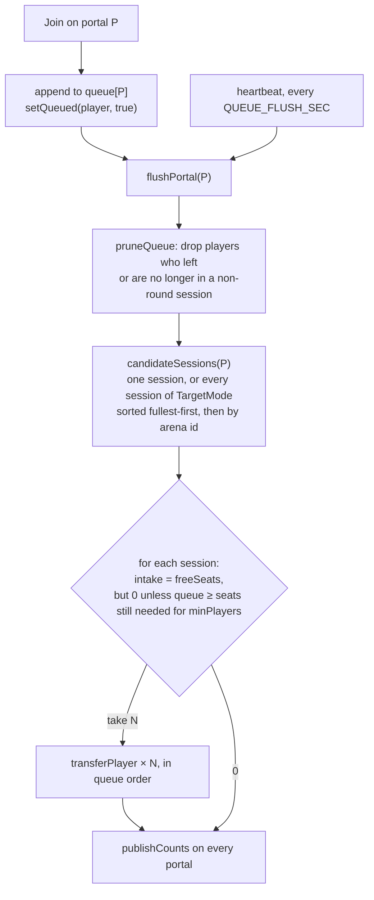

# Lobby System

The hub is a session like any other — `Arena.LOBBY_ID = "Lobby"`, running
`LobbyMode`, `runsRounds = false` — so [[systems/GameMode]] owns *being in*
the lobby. This page owns *leaving* it: the portals, the queue behind them,
and the signs and panel a player sees. Design and the decision record are in
[[design/lobby]]; this is the engineering reference.

## Ownership

| Thing | Owner | Lives in |
|---|---|---|
| Portal vocabulary — tag, attribute names, ranges, cadences | `Lobby` (shared module) | `src/shared/Lobby/init.luau` |
| Who may use a portal, the queues, the published counts | `LobbyService` (Script) | `src/server/Lobby/LobbyService.server.luau` |
| Moving a player between sessions; the `ArenaId` / `PlayerState` attributes | `SessionRegistry` — the only writer | `src/server/GameMode/Scripts/SessionRegistry.luau` |
| Whether a session has room (`freeSeats`, `minPlayers`) | `RoundManager`, from its mode config | `Scripts/GameModeService/RoundManager.luau` |
| Signs over portals, the confirm panel, proximity | `PortalGui` (LocalScript) | `src/client/UI/PortalGui.client.luau` |
| Panel and sign construction | `PortalPanelBuilder` + `PortalPanelConfig` | `src/shared/Hud/` |
| Which HUD elements hide in the hub | [[concepts/HudGate]] | `src/shared/Hud/HudGate.luau` |
| The hub geometry, portal pads, return pads | Studio, in the `.rbxl` — not in git | `Workspace.Lobby`, `Workspace.DuelPads/*/LobbyReturnPad`, the arena's `LobbyReturnPad` |

**The client decides nothing.** `PortalGui` sends "this player pressed Join
on that part" over `PortalRequest`; `LobbyService` re-derives that the part is
a portal, that the player is standing at it, and that their state permits the
move. A client-trusted portal would let anyone teleport into a duel pad from
across the hub.

## Portals

A portal is a `BasePart` tagged `ModePortal` (`Lobby.PORTAL_TAG`) carrying an
`ArenaId` (the arena it stands in) and one of two destination attributes:

| Shape | Attribute | Destination | Examples |
|---|---|---|---|
| **One session** | `TargetArenaId` | `SessionRegistry.forArena(id)` | `Portal_PvE` → `Default`; every `LobbyReturnPad` → `Lobby` |
| **A pool** | `TargetMode` (a key from `Modes/init.luau`) | every session whose `getMode()` is that mode | `Portal_PvP` → `PvPDuel` → `Duel1`, `Duel2` |

`ModeLabel` is the player-facing name. `Occupancy`, `Capacity` and `Waiting`
are **written by `LobbyService`** and read by the sign — attributes rather than
a remote, so a late-joining client reads current numbers the moment it asks
and there is no subscription to leak.

Both shapes go through the same queue (stage 6, decision 3). The earlier
"refuse while the arena is in PostRound" behaviour is gone: the player queues
and moves on the next `WaitingForPlayers`.

## The queue

Queues are keyed by the **portal part**, not by an arena id — a pool portal
has no single arena to key on. `Join` appends the player, sets
`PlayerState = Queued` through `SessionRegistry.setQueued`, and flushes the
portal at once. A 1 s heartbeat (`Lobby.QUEUE_FLUSH_SEC`) flushes every live
queue again and republishes counts, because sessions open on their own clock
(a pad's intermission ends, the boss arena leaves PostRound) and nothing in
`RoundManager` announces it server-side.



**`intake(session, waiting)`** is the one rule: the session's free seats, but
only when the queue can bring it up to its minimum. Two duel seats and one
player waiting is zero — that player stays in the hub with the practice
blocks rather than alone on a pad. The boss arena has `minPlayers = 1` and no
cap, so it takes anyone the moment it is not between rounds. This is also
what makes "a group taking the portal together lands together" hold for
duels.

**Fullest-first** ordering means a pad someone left during its countdown is
topped up before a fresh pad opens.

**`freeSeats()`** ([[systems/GameMode]] § Mode config): `PostRound` → 0; no
`maxPlayers` → unbounded; capped and `WaitingForPlayers` → the empty seats;
capped and running → 0. A capped round fills before it starts — nobody lands
in a duel already under way.

`Cancel` removes the player from that portal's queue and re-derives the
`Queued` flag from membership in any queue. Leaving the server removes the
player from every queue. A player who is transferred into an arena is pruned
from any queue on the next flush.

## Validation

`PortalRequest(player, portal, action)` is refused, with a log line and no
reply, when:

| Check | Why |
|---|---|
| Not a `BasePart`, not tagged, not in `workspace` | Anything else is a forged argument |
| Player has no `HumanoidRootPart` | Dead or loading — nothing to move |
| Farther than `Lobby.SERVER_RANGE_STUDS` (34) | The client offers the panel at 22; the server is looser so a player walking as they tap is not refused for a stud of latency, and still far too tight to use a portal from across the hub |
| `Arena.idOf(portal) ~= player.ArenaId` | Stops a lobby player reaching an arena's return pad and an arena player reaching the hub's portals |
| Under `Lobby.REQUEST_COOLDOWN_SEC` (1) since the last accepted request | A transfer moves a character and re-picks a spawn; click-speed transfers are a physics problem |
| Portal has no candidate session (`TargetArenaId` unknown, `TargetMode` not registered) | Logged as a scene error; the player is not queued |
| Unknown `action` | Only `"join"` / `"cancel"` exist (`Lobby.Action`) |

Refusals are server-log only. The client already declines to *offer* every
one of these cases (range, arena check, dead player), so a refusal reaching
the server is a bug or a forgery, not a UX moment.

## Published counts and sign copy

`publishCounts(portal)` sums the candidate sessions:

- `Occupancy` = roster count across them.
- `Capacity` = sum of `maxPlayers` when **every** candidate is capped, else 0
  meaning "uncapped". Two duel pads read `0/4 in`; the boss portal reads
  `3 inside`.
- `Waiting` = queue length.

`PortalGui.countsTextFor` renders `"%d/%d in"` or `"%d inside"`, appending
`" - %d waiting"` when the queue is non-empty. The zero case still prints —
a portal with no numbers reads as broken when nobody else is on.

## The client: PortalGui

- **Signs.** One `BillboardGui` per portal, `Lobby.SIGN_HEIGHT_STUDS` above
  the pad, refreshed from `GetAttributeChangedSignal` on the four attributes.
  Portals are discovered by tag at start, by `GetInstanceAddedSignal`, and by
  a second scan after connecting — tags replicate asynchronously and
  `addSign` is idempotent, so the belt-and-braces scan is free.
- **Panel.** Registered in the `Center` region with policy **`Always`**, not
  `LobbyOnly`: the return pad is a portal standing in the arena and needs the
  same panel. *Proximity* decides whether the panel is on screen; the arena
  check decides which portals are near you. A 0.1 s poll picks the nearest
  portal in the player's own arena within `Lobby.PANEL_RANGE_STUDS` (22).
- **Button copy** from the portal's shape: `TargetArenaId == Lobby` →
  "Return to lobby"; another arena → "Enter"; no `TargetArenaId` (a pool) →
  "Join queue" / "Leave queue", chosen by the player's own `PlayerState`
  (the client cannot see the queue table, only its state, which is enough to
  label the button; the server re-derives the truth).
- **"Not now"** dismisses only — queue membership is untouched. The dismissed
  portal is remembered until the player walks out of range, otherwise the
  poll would re-show the panel a tenth of a second later and the button would
  read as broken.
- A dead player has no panel (`livingRoot()` is nil).

Two Roblox deferral bugs were found here and are recorded in [[design/lobby]]
§ Stage 4 detail (4c): `GetPropertyChangedSignal` firing after the flag that
guarded it was cleared, and `Tween:Cancel()` re-firing `Completed`.

## Player state

`SessionRegistry` publishes `ArenaId` and `PlayerState` (`InLobby` /
`Queued` / `InArena`) on the Player. The arena half is derived from the
session's mode (`runsRounds` → `InArena`); `Queued` is pushed in by
`LobbyService`, since a queued player is standing in the hub like everyone
else. Entering an arena clears the flag. Readers: `HudGate` (HUD
suppression), `PortalGui` (button copy), `BlockTapController` (not a
`GuiObject`, so it reads the attribute directly).

What hides in the hub and what stays live is the per-element policy table in
[[concepts/HudGate]] § Triage. The short version: round and competition chrome
hides (health bar, kill feed, scoreboard, timer, game state, boss HUD, death
screen, damage feedback); everything the core verb touches stays (letter
tiles, memorize, spell menu, MindFull indicator, buff tray).

## The hub, in the scene

`Workspace.Lobby` (stage 4b, 2026-09-07): origin `(-600, 202, 28)`, floor top
`y = 203` to match the arena plaza, 140 × 140 walled shell, two portal arches
(`Portal_PvE`, `Portal_PvP`), five `LobbySpawn` pads, a 70 × 20 × 56
`BlockSpawnVolume` (practice blocks are ordinary blocks — energy is granted
at memorize, so there is nothing to suppress), and a `Damageable` target
dummy. Every part carries `ArenaId = Lobby`. Return pads: `LobbyReturnPad` on
the arena bridge (52 studs from its spawn, so arriving does not greet you with
"Return to lobby") and one per duel pad.

Geometry is in `BrainFighter.rbxl`, not git — Rojo maps no `Workspace`. The
same is true of the portal attributes, so a portal that "stopped working"
after a place-file revert is the first thing to check.

## Constants (`src/shared/Lobby/init.luau`)

| Name | Value | Meaning |
|---|---|---|
| `PORTAL_TAG` | `"ModePortal"` | The portal pad tag |
| `Attributes.TargetArenaId` / `TargetMode` / `ModeLabel` | — | Destination and label, authored |
| `Attributes.Occupancy` / `Capacity` / `Waiting` | — | Published by the server |
| `PANEL_RANGE_STUDS` | 22 | Client offers the panel |
| `SERVER_RANGE_STUDS` | 34 | Server honours a request |
| `REQUEST_COOLDOWN_SEC` | 1 | Per-player accepted-request spacing |
| `QUEUE_FLUSH_SEC` | 1 | Heartbeat cadence |
| `SIGN_HEIGHT_STUDS` | 16 | Billboard height |
| `Action` | `"join" \| "cancel"` | The two remote actions |

## Files

```
src/shared/Lobby/
  init.luau                        — vocabulary + ranges (above)
  Remotes/PortalRequest.model.json — the one RemoteEvent (client → server)
src/server/Lobby/
  LobbyService.server.luau         — queues, validation, flush heartbeat, published counts
src/client/UI/
  PortalGui.client.luau            — signs + panel + proximity
src/shared/Hud/
  PortalPanelBuilder.luau · PortalPanelConfig.luau
```

## Verification

- **Stage 4c** (2026-09-07, client-side): hub HUD suppressed and restored
  across a portal; `LobbyService` logged `took Boss Fight -> Default`, `took
  Return to Lobby -> Lobby`, `queued for Duel (position 1)`, `left the
  queue`, `Portal refused ... out of range (80 studs)`.
- **Stage 6** (2026-09-19, client-side): PvP portal `0/4 in` → `0/4 in - 1
  waiting` on Join, back to `0/4 in` on Leave queue; boss portal transferred
  at once; return pad brought the player home with the HUD gated off.
- **Two-client duel** (queue of two lands together, forfeit, countdown
  leaver): user-driven, `nimbalyst-local/stage6-duel-two-client.md`.

## Tests

The queue itself has no suite: it is Script-local state in `LobbyService`,
and the only observable surface is the portal attributes plus transfers,
which need a second real client to mean anything. What the Multiplayer suite
does pin ([[systems/Tests]]):

- `duel_waits_for_two` — the seat rule the queue relies on (`freeSeats`,
  `minPlayers`, a one-player duel stays waiting).
- `scene_slots_have_sessions` — every pool portal names a registered mode;
  every `ArenaSlot` has a session.
- `transfer_moves_roster_and_attributes`, `registry_views_agree` — the
  transfer the flush performs.

If the queue grows rules (priorities, party grouping), extract
`candidateSessions` / `intake` / `flushPortal` into a `LobbyQueue` module so
they can be driven with fake sessions the way `duel_win_condition` drives
`PvPDuel`.

## Cross-references

- Design and decisions → [[design/lobby]] (stages 4, 5, 6 detail)
- Scaling the pad pool, and why it stays fixed for now → [[design/arena-instancing]]
- Sessions, `freeSeats`, `minPlayers`, transfer, player state → [[systems/GameMode]]
- HUD suppression policy table → [[concepts/HudGate]]
- Round-over copy on return (`OPPONENT LEFT`, `BOSS DEFEATED`) → [[systems/HUD]] § RoundOutcomeCopy
