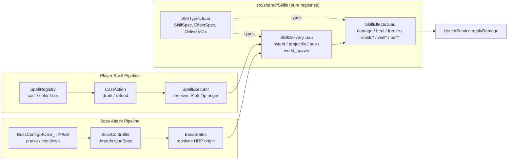
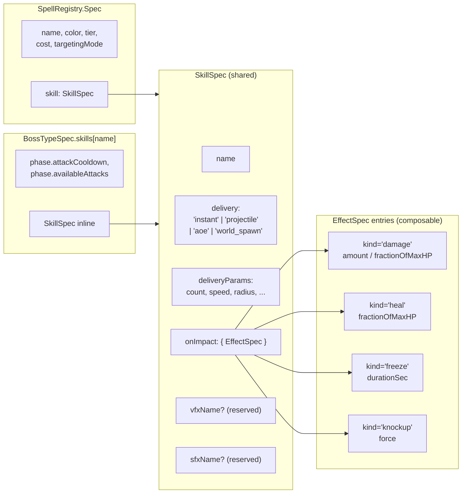
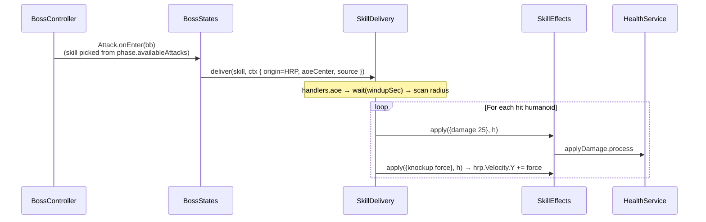
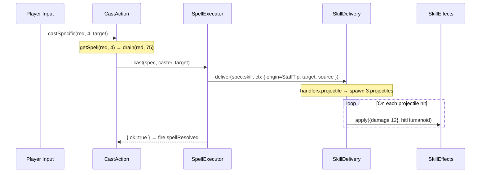
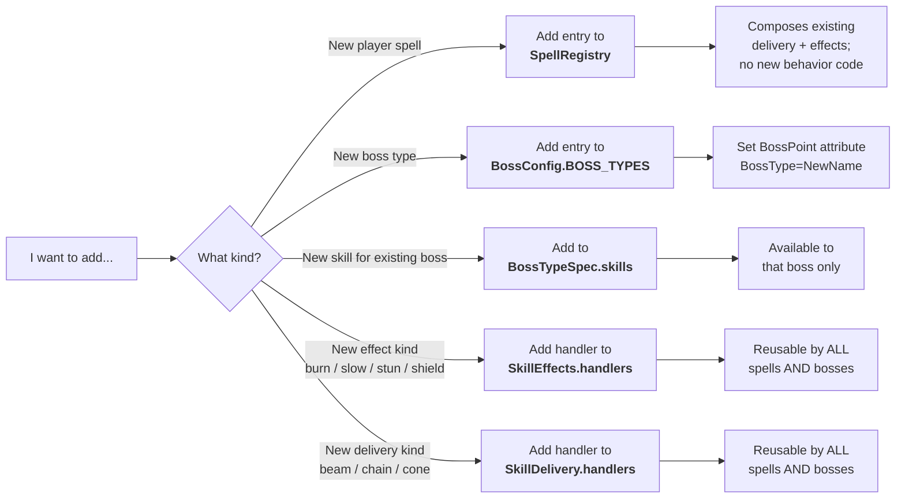

# Skill Pipeline

A unified data + dispatch pipeline shared by **player spells** and **boss attacks**. Every "thing that does combat" — a spell, a boss skill, a future NPC ability — is described by the same `SkillSpec` data shape and executed by the same two registries.

Shipped in commit `03b6080` (replaces the old boss-only `BossAttacks.luau` and the inline dispatch in `SpellExecutor`).

## TL;DR

- **`SkillSpec`** = pure data: `{ delivery, deliveryParams, onImpact: { EffectSpec } }`
- **`SkillDelivery`** = how the skill reaches its target (`instant`, `projectile`, `aoe`, `world_spawn`)
- **`SkillEffects`** = what happens on impact (`damage`, `heal`, `freeze`, stubs for `shield` / `wall` / `buff`)
- **Wrappers** ([[systems/SpellRegistry]], `BossConfig.BOSS_TYPES`) add context-specific fields (cost/color/tier or phase/cooldown)
- Adding a new effect kind once makes it available to every spell and every boss attack — no caller changes

## Architecture

The registries are **pure**: they never branch on caster type, don't know about staffs vs boss rigs, don't touch cost or cooldown. Each caller ([[systems/SpellExecutor]], `BossStates`) resolves its own context (origin CFrame, source instance) and passes it via `DeliveryCtx`.

`*` = stub handler in SkillEffects (returns `ok=true`, logs). Will activate when the backing system lands. See [Reserved Hooks](#reserved-hooks-not-yet-implemented).

## Data Shape

`onImpact` is an **array** — a single skill can apply multiple effects in sequence (e.g., GroundSlam does damage + knockup; Sanctuary does heal + shield).

## Execution Flow — Boss GroundSlam

## Execution Flow — Player Casts Volley (boss skill exposed as a spell)

**Note**: this is the exact same `SkillDelivery.handlers.projectile` that the boss's FireballVolley uses. The only difference is the origin (Staff Tip vs Boss HRP) and the wrapping context (SpellRegistry adds cost; BossConfig adds phase).

## Where Do I Add New Content?

## Module Reference

| Path | Role | Owns |
|---|---|---|
| `src/shared/Skills/SkillTypes.luau` | Pure types | `SkillSpec`, `EffectSpec`, `DeliveryCtx` |
| `src/shared/Skills/SkillEffects.luau` | Effect handlers | `apply(spec, target, source)`, `handlers.{damage, heal, freeze, ...}` |
| `src/shared/Skills/SkillDelivery.luau` | Delivery handlers | `deliver(skill, ctx)`, `handlers.{instant, projectile, aoe, world_spawn}` |
| `src/shared/SpellRegistry/init.luau` | Player spell wrapper | `Spec { name, color, tier, cost, targetingMode, skill }` |
| `src/shared/SpellExecutor/init.luau` | Player cast entry | `cast(spec, caster, target)`, `resolveSpellOrigin(caster)` |
| `src/shared/CastAction/init.luau` | Player resource gate | drain → cast → refund |
| `src/shared/Boss/BossConfig.luau` | Boss type registry | `BOSS_TYPES`, `DEFAULT_TYPE` |
| `src/shared/Boss/BossTypes.luau` | Boss wrapper types | `BossTypeSpec`, `PhaseSpec`, `BossBlackboard` |
| `src/server/Boss/BossService.server.luau` | Boss lifecycle | Resolves type from `BossPoint:GetAttribute("BossType")` |
| `src/server/Boss/Scripts/BossController.luau` | Per-boss controller | Owns blackboard, threads typeSpec |
| `src/server/Boss/Scripts/BossStates.luau` | Boss FSM + cast dispatch | Resolves HRP origin, calls `SkillDelivery.deliver` |

## Reserved Hooks (not yet implemented)

The schema includes fields handlers currently ignore. They will activate when their backing systems land:

- `SkillSpec.vfxName: string?` — fires named VFX on cast/impact (blocked on [[systems/VisualEffects]] Phase C: VfxController)
- `SkillSpec.sfxName: string?` — plays named SFX on cast/impact (blocked on SFX module — no system exists yet, see [[systems/AudioSFX]])
- `EffectSpec.kind = "shield"` — stub in SkillEffects; blocked on Health absorb-pool system
- `EffectSpec.kind = "buff" / "debuff"` — blocked on status-effect manager (apply/tick/expire lifecycle)
- `EffectSpec.kind = "wall"` — stub; blocked on placement targeting UX + world-instance lifecycle

Adding these later requires **only** wiring the handlers — no schema changes, no caller changes.

## VFX Layers

Three distinct VFX runtimes coexist. Knowing which lane a new visual belongs in is upstream of the SingleOwnership rule — each lane has a separate spawn site, lifetime model, and reason for being.

| Lane | Spawn site | Lifetime | Use when… |
|---|---|---|---|
| **Burst VFX** | `VfxController` clones from `VfxConfig.EFFECTS` via `Shared/Vfx/spawnEffect.luau` | Fire-and-forget; `totalDurationSec` from the EffectSpec | The visual is a one-shot particle burst at cast (staff tip) or impact (target HRP). |
| **Status visuals** | `SkillEffects.handlers.<kind>` invokes a module under `src/shared/Vfx/StatusVisuals/` (e.g. `FreezeVfx`) | Persistent welded geometry, lives for the duration of the active status; cleanup is reciprocal (`start` + `stop`) | The effect is a persistent body decoration (ice shards, burn marks, poison cloud) that must follow limbs and survive a multi-second status. Burst particles can't carry these semantics. |
| **Delivery visuals** | Inline in `SkillDelivery.handlers.{projectile, aoe}` — the physical `Part` is the visual | Tied to the physics object (`Debris:AddItem`) | The visual IS the gameplay object (the projectile body, the shockwave geometry). For cosmetic upgrades (trail/glow/sound) on top, set `deliveryParams.cosmeticEffectId` and the handler attaches the corresponding `VfxConfig.EFFECTS` entry to the moving Part — physics still lives in `SkillDelivery`, the *cosmetic* layer routes through `VfxConfig`. |

Color source is shared across all three lanes: `VfxConfig.COLORS.{red,green,blue}.{primary,glow,accent}`. Status visuals and delivery visuals should never hardcode a `Color3` — pull from the palette so a future red/blue retheme touches one table.

Cross-client replication: only burst VFX replicate (via `BroadcastSpellVfx` → `SpellVfxEvent`). Delivery visuals are local to the firing client; status visuals are local to whichever VM ran the `freeze` handler. Replicating the latter two is a follow-up if/when it matters for gameplay readability.

## Modularity Invariants

These are load-bearing. If you find yourself wanting to violate one, stop and reconsider the design:

1. **Registries are pure.** No branching on caster type, no knowledge of staffs / boss rigs / cost / cooldown.
2. **Origin is caller-resolved.** Callers compute `DeliveryCtx.origin` and pass it in. The delivery handler never asks "is this a Player?"
3. **`SkillSpec` is data-only.** No functions, no behavior. Wrappers add context-specific fields outside `SkillSpec`.
4. **`onImpact` is an array.** Multi-effect skills compose by listing entries. No nested effect specs. **`VfxController` plays one impact burst per unique `kind`** in the array, so multi-effect spells (e.g. Sanctuary `{ heal, shield }`) render layered VFX.
5. **Single-write ownership.** Only `SkillEffects.handlers.freeze` writes to `Humanoid.WalkSpeed` for freeze. Only `SkillDelivery.handlers.projectile` spawns projectiles. See [[concepts/SingleOwnership]].
6. **VFX color flows through `VfxConfig.COLORS`.** No `Color3.fromRGB(…)` literals in status visuals or delivery visuals; pull from the palette. Burst VFX entries declare `color = C.<color>` in their `EmitterSpec`.

## See also

- [[systems/SpellRegistry]] — player spell wrapper (cost / color / tier)
- [[systems/SpellExecutor]] — thin adapter that resolves origin and delegates to SkillDelivery
- [[systems/CastAction]] — drain → cast → refund pipeline for player spells
- [[systems/Boss]] — boss attacks dispatched through the same pipeline
- [[systems/Health]] — `applyDamage.process` path used by damage effects
- [[systems/VisualEffects]] — VFX system that will consume `SkillSpec.vfxName`
- [[systems/AudioSFX]] — SFX inventory; future SFX module will consume `SkillSpec.sfxName`
- [[concepts/SingleOwnership]] — the invariant that keeps registry handlers conflict-free
