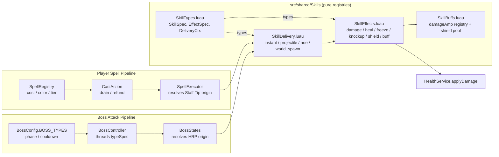
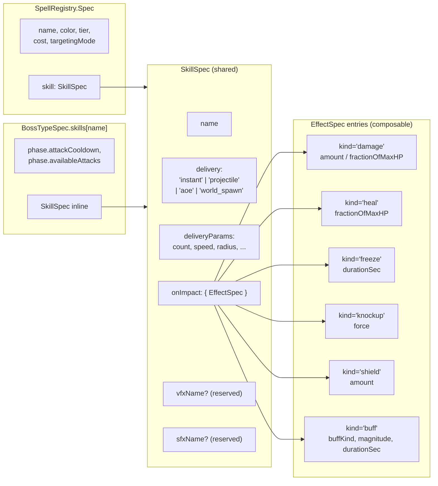
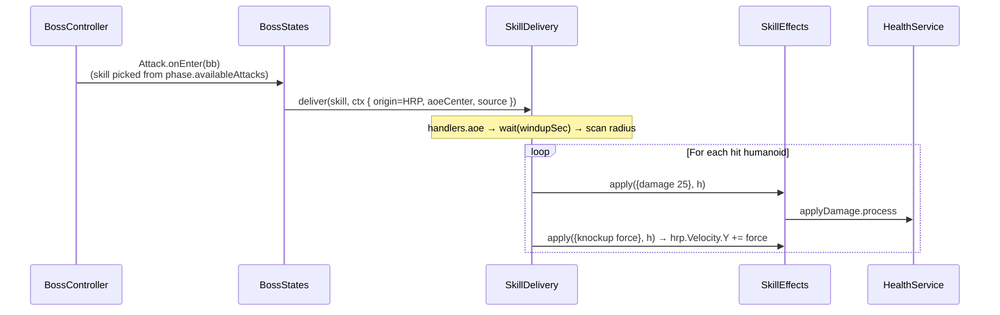
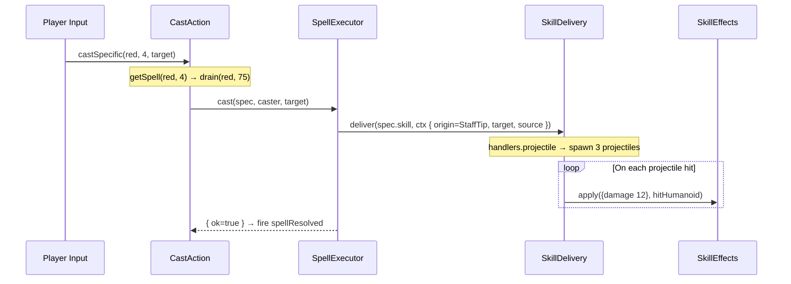
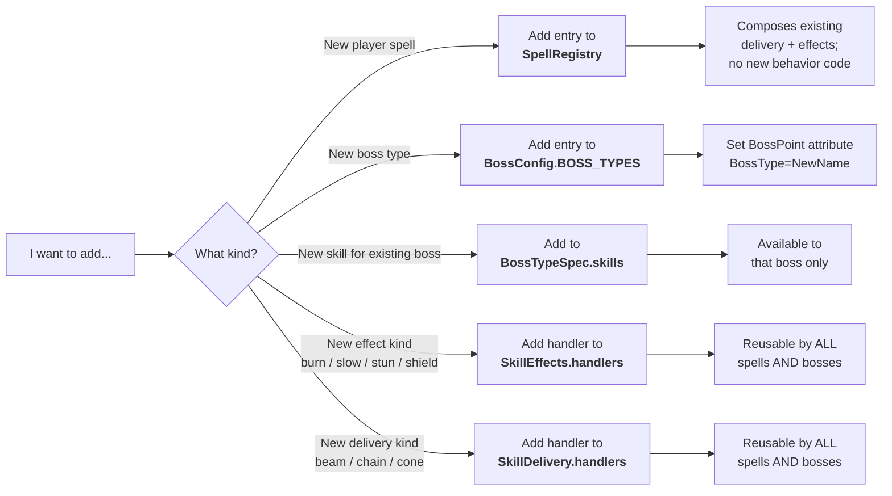

# Skill Pipeline

A unified data + dispatch pipeline shared by **player spells** and **boss attacks**. Every "thing that does combat" — a spell, a boss skill, a future NPC ability — is described by the same `SkillSpec` data shape and executed by the same two registries.

Shipped in commit `03b6080` (replaces the old boss-only `BossAttacks.luau` and the inline dispatch in `SpellExecutor`).

## TL;DR

- **`SkillSpec`** = pure data: `{ delivery, deliveryParams, onImpact: { EffectSpec } }`
- **`SkillDelivery`** = how the skill reaches its target (`instant`, `projectile`, `aoe`, `world_spawn`)
- **`SkillEffects`** = what happens on impact (`damage`, `heal`, `freeze`, `knockup`, `shield`, `buff` — all real as of Phase 5.2; the `wall` stub was deleted, see [Defensive layer](#defensive-layer-shield--buff--wall-phase-52))
- **Wrappers** ([[systems/SpellRegistry]], `BossConfig.BOSS_TYPES`) add context-specific fields (cost/color/tier or phase/cooldown)
- Adding a new effect kind once makes it available to every spell and every boss attack — no caller changes

## Architecture

```mermaid
graph LR
    subgraph Player["Player Spell Pipeline"]
        direction TB
        SR["SpellRegistry<br/>cost / color / tier"]
        CA["CastAction<br/>drain / refund"]
        SE["SpellExecutor<br/>resolves Staff Tip origin"]
        SR --> CA --> SE
    end

    subgraph Shared["src/shared/Skills (pure registries)"]
        direction TB
        ST["SkillTypes.luau<br/>SkillSpec, EffectSpec, DeliveryCtx"]
        DR["SkillDelivery.luau<br/>instant / projectile / aoe / world_spawn"]
        ER["SkillEffects.luau<br/>damage / heal / freeze / knockup / shield / buff"]
        BR["SkillBuffs.luau<br/>damageAmp registry + shield pool"]
        ER --> BR
        ST -.types.-> DR
        ST -.types.-> ER
        DR --> ER
    end

    subgraph Boss["Boss Attack Pipeline"]
        direction TB
        BC["BossConfig.BOSS_TYPES<br/>phase / cooldown"]
        BCT["BossController<br/>threads typeSpec"]
        BST["BossStates<br/>resolves HRP origin"]
        BC --> BCT --> BST
    end

    SE --> DR
    BST --> DR
    ER --> HS["HealthService.applyDamage"]
```

The registries are **pure**: they never branch on caster type, don't know about staffs vs boss rigs, don't touch cost or cooldown. Each caller ([[systems/SpellExecutor]], `BossStates`) resolves its own context (origin CFrame, source instance) and passes it via `DeliveryCtx`.

Every effect and delivery handler is real as of Phase 5.2. The refund path that Phase 5.1 built for stubs is still load-bearing — [[systems/CastAction]] drains before executing, so any genuine rejection (a targeted spell cast with no target, an unknown effect kind) hands the mana back rather than charging for a no-op.

## Data Shape

```mermaid
graph LR
    subgraph PlayerWrapper["SpellRegistry.Spec"]
        W1["name, color, tier,<br/>cost, targetingMode"]
        S1["skill: SkillSpec"]
    end

    subgraph BossWrapper["BossTypeSpec.skills[name]"]
        W2["phase.attackCooldown,<br/>phase.availableAttacks"]
        S2["SkillSpec inline"]
    end

    subgraph SkillCore["SkillSpec (shared)"]
        SN["name"]
        SD["delivery:<br/>'instant' | 'projectile'<br/>| 'aoe' | 'world_spawn'"]
        SDP["deliveryParams:<br/>count, speed, radius, ..."]
        SOI["onImpact: { EffectSpec }"]
        SVF["vfxName? (reserved)"]
        SSF["sfxName? (reserved)"]
    end

    subgraph Effects["EffectSpec entries (composable)"]
        E1["kind='damage'<br/>amount / fractionOfMaxHP"]
        E2["kind='heal'<br/>fractionOfMaxHP"]
        E3["kind='freeze'<br/>durationSec"]
        E4["kind='knockup'<br/>force"]
        E5["kind='shield'<br/>amount"]
        E6["kind='buff'<br/>buffKind, magnitude, durationSec"]
    end

    S1 --> SkillCore
    S2 --> SkillCore
    SOI --> E1
    SOI --> E2
    SOI --> E3
    SOI --> E4
    SOI --> E5
    SOI --> E6
```

`onImpact` is an **array** — a single skill can apply multiple effects in sequence (e.g., GroundSlam does damage + knockup). Sanctuary is `{ heal, shield }` again as of 5.2; its `shield` entry had been removed in 5.1 because a failing stub after a *real* full heal would have triggered the refund path, making it a free full heal.

## Execution Flow — Boss GroundSlam

```mermaid
sequenceDiagram
    participant Ctrl as BossController
    participant States as BossStates
    participant DR as SkillDelivery
    participant ER as SkillEffects
    participant HS as HealthService

    Ctrl->>States: Attack.onEnter(bb)<br/>(skill picked from phase.availableAttacks)
    States->>DR: deliver(skill, ctx { origin=HRP, aoeCenter, source })
    Note over DR: handlers.aoe → wait(windupSec) → scan radius
    loop For each hit humanoid
        DR->>ER: apply({damage 25}, h)
        ER->>HS: applyDamage.process
        DR->>ER: apply({knockup force}, h) → hrp.Velocity.Y += force
    end
```

## Execution Flow — Player Casts Volley (boss skill exposed as a spell)

```mermaid
sequenceDiagram
    participant P as Player Input
    participant CA as CastAction
    participant SE as SpellExecutor
    participant DR as SkillDelivery
    participant ER as SkillEffects

    P->>CA: castSpecific(red, 4, target)
    Note over CA: getSpell(red, 4) → drain(red, 75)
    CA->>SE: cast(spec, caster, target)
    SE->>DR: deliver(spec.skill, ctx { origin=StaffTip, target, source })
    Note over DR: handlers.projectile → spawn 3 projectiles
    loop On each projectile hit
        DR->>ER: apply({damage 12}, hitHumanoid)
    end
    SE-->>CA: { ok=true } → fire spellResolved
```

**Note**: this is the exact same `SkillDelivery.handlers.projectile` that the boss's FireballVolley uses. The only difference is the origin (Staff Tip vs Boss HRP) and the wrapping context (SpellRegistry adds cost; BossConfig adds phase).

### Projectile detonation model (2026-08-03)

A projectile is a physics `Part` on a straight `LinearVelocity` — it never curves after launch (`trackTarget` only re-resolves the aim point at each staggered *launch*). Every Heartbeat it checks four detonation causes, in this order, and all four route through one `detonate()` closure:

| Cause | Trigger | Fixes |
|---|---|---|
| `expiry` | `lifetimeSec` elapsed | splash spells no longer vanish silently at end of flight |
| `impact` | swept ray over this frame's step hits world geometry or a rig limb | projectiles stop at cover instead of flying through it; also closes the tunnelling gap — at Fireball's 55 studs/s a >54 ms frame steps clean over the 3-stud shell |
| `proximity` | any hittable's HRP within `proximityRadius` | the original (and only) check |
| `fuze` | closest approach to `ctx.target` while inside `impactRadius` — splash spells only | **the actual fix for "Fireball sometimes does no damage"** |

The `fuze` is the load-bearing one. Because the shot is aimed where the target stood at launch, a target strafing during a ~1 s flight is routinely missed by the 3-stud shell while still well inside a 7-stud blast radius — and `expiry` doesn't save it, since a Fireball outruns its target by ~80 studs before the timer runs out. Fuzing at closest approach converts those near-misses into full splash damage. It is deliberately restricted to `ctx.target` so a bystander near the muzzle can't detonate the shot as it leaves the staff.

When `impactRadius == 0` (Firebolt, Volley, both boss FireballVolleys) the fuze is off and only a direct hit damages — `expiry` and a wall `impact` deal nothing, they just stop the Part.

**`impactRing` — a splash can skip the ground disc (2026-08-09).** Default true, which is the historical behaviour: a splash detonation draws the neon `SkillVisuals.spawnShockwave` disc sized to `impactRadius`, and the impact burst anchors *to that disc*. Set it false and the disc is skipped while the splash and its burst survive — the burst then anchors to a throwaway `spawnEffectAtPoint` anchor instead, which is also why it stays visible on clients that haven't replicated a Part created this frame. Fireball is the only spell using it: once its impact drew Inferno's fire, the disc underneath read as a separate flat decal on the floor rather than part of the same event.

**What you give up is radius legibility**, and it is a real tradeoff rather than a free win — the disc is the only thing that draws the blast's exact reach, so turning it off is only defensible where the burst is big enough to imply it. That is why Fireball's `impact_damage_t2` grew in `spreadAngle` as much as in `size` in the same change. `impactColor` only ever tinted the ring, so it is dead config on any spell with `impactRing = false` and Fireball dropped it. Verified on a client: a real Fireball detonation produces 0 `SkillShockwave` and 1 `SkillEffectAnchor`; an otherwise-identical probe spec with `impactRing` unset still produces its ring.

**Behaviour change to know about**: projectiles are now blocked by cover, boss attacks included. `RaycastParams.RespectCanCollide = true` keeps shockwaves, VFX parts, and other decorative non-collidable geometry from eating shots; the caster and the projectile itself are excluded from the ray. Verified in-playtest: a 5-stud miss deals 20 damage, a 10-stud miss deals 0, a rig 3 studs behind a wall takes splash, a rig 29 studs behind takes nothing.

## Registry Lifecycle & Death Cleanup (Phase 5.1)

Both per-Humanoid registries (`SkillEffects._freezeState`, `SkillInterrupt._active`/`_silenced`) used to be cleaned only by their happy timer/finish paths — a humanoid that died or despawned mid-freeze (or mid-cast) leaked its entries forever, including orphaned FreezeVfx ice shards. Since 5.1 each registry installs one-shot cleanup connections the first time a humanoid is tracked:

- **`Humanoid.Died`** — real character deaths (players, NPCs, boss).
- **`Humanoid.HealthChanged <= 0`** — backup for `Died`: the Dead state transition never fires on partial/synthetic rigs (verified empirically — even `ChangeState(Dead)` with a neck Motor6D sticks in `FallingDown`). Purges are idempotent, so both firing is harmless.
- **`Humanoid.Destroying`** — despawns without death. Note the place runs **deferred signal behavior**: handlers run at the next resumption point, never synchronously — anything observing a purge must poll, not assert inline.

`SkillEffects.isFrozen(target)` is a read-only probe added for tests/diagnostics. On purge, freeze restores WalkSpeed only on the timer path (`purgeFreeze(h, true)`); death/despawn paths skip the write and still clear the `_frozen` flag (which is what tears down the shards) and unsilence.

Note the flag and `_freezeState` are separate: `_freezeState` is per-VM gameplay state, the attribute is the replicated render signal, and `setFrozenFlag` is the only thing that writes the latter. Clearing the attribute by hand — as a debug script might — desyncs them, and the next freeze takes the *extend* branch, which correctly doesn't rewrite a flag it believes is already set. Drive freeze through `SkillEffects.apply`, not through the attribute.

## Defensive layer: shield / buff / wall (Phase 5.2)

The three Phase 5.1 stubs resolved into **two** real effects and one deletion. What the roster actually needed was not what the stub names suggested:

| Stub | Outcome | Why |
|---|---|---|
| `shield` | **Real effect.** Grants a flat absorb pool. | Blue T2 Shield and Green T3 Sanctuary both want it. |
| `buff` | **Real effect.** Timed stat modifier, keyed by `buffKind`. | Its first consumer is Stasis's damage amp — which the registry had been declaring as `freeze.damageAmpMultiplier` while the freeze handler silently ignored it. |
| `wall` | **Deleted.** | Nothing ever used it. Stone Wall is a `world_spawn` *delivery* with an empty `onImpact` — the Part is the effect. The effect handler was a decoy. |

### Shield — ownership splits across two systems

The absorb pool lives in the character Model's `_shield` attribute, **not** in a Skills-local table, because [[systems/Health]]'s `DamageModifierRegistry.shieldModifier` already reads and drains that attribute inside `applyDamage.process` — the exact path boss attacks take. Storing it anywhere else would mean reimplementing absorption on a path that already has it.

So ownership splits deliberately, and this is the one place it's allowed to:

- **Skills grants** the pool (`SkillBuffs.grantShield`) — additive, so Sanctuary layered on Shield is worth both.
- **Health drains** it (`DamageModifierRegistry.shieldModifier`) for damage that reaches the body through `applyDamage`.
- **Skills also drains** it (`SkillBuffs.consumeShield`) at a flat cost per projectile the shell deflects — see [Shell](#shield--the-shell-blocks-projectiles) below.
- Nothing else writes the attribute.

Two drain sites rather than one is deliberate, and player spells are what make it load-bearing: they write `Humanoid.Health` directly and never enter `applyDamage`, so a projectile blocked at the shell has no route to `shieldModifier` at all. A projectile stopped before impact also never runs an effect handler, so there is nothing downstream to charge the pool.

The pool has **no expiry** (design call 2026-08-03): it lasts until damage eats it or the holder dies. That makes death cleanup the only thing standing between it and an indefinite leak, so `SkillBuffs` installs the same `Died` / `HealthChanged<=0` / `Destroying` hooks the other registries use. Give it a duration in `SpellRegistry` if playtest says it overstays.

**The shield only works where `applyDamage` runs — the server.** A client-set attribute never replicates upward, so an unrelayed shield protects nothing. See [Self-cast relay](#self-cast-relay) below.

### Shield — the shell blocks projectiles

The pool projects a **spherical shell**, `SkillBuffs.SHELL_RADIUS_STUDS` (4.2) centred on the holder's HumanoidRootPart. `SkillDelivery.projectile` sweeps each frame's step against every shielded rig's shell and stops the shot at the surface:

- The shell is swept **against the same segment as the world raycast, and the nearer blocker wins**. Tested before the raycast result is used, because a shot that would clip a limb this frame still had to cross the bubble to reach it.
- The shell is **analytic, not a Part** — a ray/sphere intersection in `segmentSphereEntry`. It has to be: the bubble `ShieldVfx` draws is a per-client cosmetic, invisible to the server that owns boss fire, so there is no geometry for `workspace:Raycast` to find. This is also why `SkillBuffs.SHELL_RADIUS_STUDS` is the single source of truth for both — the visual reads it for its diameter, so what you see is exactly what blocks.
- The radius is **fixed, not measured off the live rig**. A bounding box breathes with the walk animation, and a hit volume that grows and shrinks per frame is neither testable nor fair.
- The shell is **inflated by the projectile's half-extent**, so contact is measured surface-to-surface rather than centre-to-centre. Without this, Brain's 2-stud fireballs whose bodies visibly clipped the bubble but whose centres passed outside it flew straight through — on screen, a shot hitting the shield and not being destroyed.
- A blocked shot is **destroyed outright**. No splash, no effect handlers — which means a shielded player also covers whoever is standing next to them.
- The pool is charged a **flat `SkillBuffs.SHELL_BLOCK_COST`** (5) per deflection, *not* the shot's damage. The shell is a barrier that destroys projectiles, not a damage sponge that happens to stop them — charging full damage made a 40 pool worth 2.6 of Brain's fireballs, which inside a 30-shot volley is indistinguishable from having no shield. At 5 a shield is worth **8 deflections**, tunable by that constant alone.
- The asymmetry is the point: **deflection is cheap, absorption is not.** Damage that actually reaches the body — GroundSlam, melee, anything non-projectile — still drains the pool at full value through `shieldModifier`, untouched.

### Shield — why projectiles are server-simulated

Projectiles call `SetNetworkOwner(nil)` on the server. Without it Roblox hands ownership of a free-moving part to the **nearest player** — so a shot aimed at someone is simulated by the very client it is about to hit, and that client's copy runs ahead of the server's. The server would destroy the shot on the shell while the client kept drawing it forward.

This was reported as "boss projectiles pass through the shield" and is worth recording precisely, because server-side logs said the opposite (every shot blocked, no damage taken) and the bug was only visible by measuring what the *client* rendered:

| Client-rendered, one boss engagement | Before | After |
|---|---|---|
| Projectiles rendered inside the bubble (<4.2) | 69 of 80 | **0 of 90** |
| Projectiles rendered through the body (<2.0) | 20 | **0** |
| Closest approach ever rendered | 0.50 studs | 17.5 studs |
| Health lost | 0 | 0 |

It is also the correct trust boundary independent of the visuals: the client being shot at should not own the bullet.

### Projectile visuals are client-local

Server simulation fixed the penetration but introduced the mirror problem: clients render server-owned parts *behind* the server, so a blocked shot vanished ~12 studs short of the bubble instead of on it. The fix is a **visual/authority split**.

| | Authoritative shot | Cosmetic shot |
|---|---|---|
| Where | Server only (`SkillDelivery.projectile`) | Every client (`Vfx/CosmeticProjectile`) |
| Visible | No — `Transparency = 1`, no trail | Yes; this is the only one anyone sees |
| Does | Raycast, shell block, damage, pool drain | Nothing but fly, die, and *sound* its death |
| Physics | `LinearVelocity`, `SetNetworkOwner(nil)` | Anchored, hand-stepped per Heartbeat |

The cosmetic owning the **death cue** (2026-08-04) follows from the same split: boss fire never runs a client `detonate`, so the cosmetic is the only thing that can make a shot audible to someone who can't see it. See [[systems/AudioSFX]] § "Projectile death cue" for the per-cause suppression table and the which-VM-plays-it rule — the trap being that `projectile` runs on both VMs, so an unguarded cue double-plays for the caster.

### `consumeOnHit` — does the shot end on the rig it hits?

`deliveryParams.consumeOnHit`, **default `true`** (2026-08-04). True is what the whole roster does and what the code always did implicitly; making it a named option is what allows a piercing shot without a second delivery kind.

| | `true` (default) | `false` (pierce) |
|---|---|---|
| First rig reached | detonates, shot destroyed | `onImpact` lands **once**, shot flies on |
| Walls / world geometry | ends the shot | ends the shot |
| Shield shell | blocked, charged `SHELL_BLOCK_COST` | **also blocked** — a bubble is a barrier, not a body |
| Expiry | ends the shot | ends the shot |

Forced `true` when `impactRadius > 0`: a blast that re-detonates on every rig it passes through would stack its own damage, and the radius already reaches past whatever triggered it.

Piercing needs two things that are easy to miss. A **per-shot `pierced` set**, because a rig sitting inside `proximityRadius` is otherwise re-damaged every frame the shot overlaps it — several free hits at a 3-stud radius. And the pierced rig must be **added to the ray filter**, which is what physically lets the shot continue; note `FilterDescendantsInstances` returns a *copy*, so it has to be reassigned rather than appended to in place. Both sides do this, and `CosmeticProjectile.rigFromPart` deliberately resolves the Model carrying the Humanoid rather than the nearest Model ancestor — filtering a nested accessory model would leave the rest of the body still blocking.

**Every termination rule has to exist on both sides.** The authoritative shot dies on four rules — swept raycast, shield shell, an HRP within `proximityRadius`, and expiry — and the cosmetic originally implemented only the first, second and fourth. The gap was visible in play: a boss fireball is 2 studs wide against a 3-stud proximity radius, so a shot whose *centre line* passed beside a player detonated and dealt damage server-side while the copy everyone could see flew on through them. `proximityRadius` now crosses on the launch payload and the cosmetic checks it at the same point in the frame the server does. Anything added to one side's termination rules from here needs adding to the other, or damage and visuals desync again — the same coupling already called out for `SkillBuffs.shellEntry`.

The server broadcasts launch parameters over `ProjectileVfxEvent`; each client replays them locally. This is safe to predict because a shot is a **straight line at constant velocity** — the client reproduces the exact path from the launch parameters alone, with no correction traffic. It is not guessing at the outcome, it is evaluating the same geometry against state it already has (`_shield` replicates, and the bubble is drawn from it). Divergence is bounded by construction: if client and server disagree about a block, the client loses a cosmetic and the server still decides who took damage.

`SkillBuffs.shellEntry` is shared by both paths deliberately — a second copy of the intersection maths on the other VM is a desync waiting to happen.

**This also fixed a latent duplicate.** `projectile` delivery runs on *both* VMs — unlike `world_spawn`, which guards for exactly this reason — so a player cast always produced a server Part *and* a client Part. It went unnoticed because the caster's client owned and simulated both in lockstep, drawing them on top of each other; `SetNetworkOwner(nil)` broke that lockstep and would have shown the caster two fireballs. With the server copy invisible the caster sees one. The casting client skips its own broadcast (`casterUserId`, the same pattern `VfxController` uses for bursts) since its local shot is already frame-perfect.

Measured client-side across the same boss engagement:

| Client-rendered | Original | Server-simulated | Client-local visuals |
|---|---|---|---|
| Rendered inside the bubble (<4.2) | 69 of 80 | 0 of 90 | **0 of 78** |
| Rendered through the body (<2.0) | 20 | 0 | **0** |
| Closest approach rendered | 0.50 studs | 17.5 studs | **5.21 studs** |
| Died on the shell surface | — | — | **60 of 78** |
| Visible duplicates for the caster | 1 (masked) | 2 | **1** |

5.21 studs is the shell surface itself (4.2 radius + 1.0 half-extent for a 2-stud fireball). The remaining 18 are shots that missed and died on walls or expiry.

Earlier single-shot checks still hold: an unshielded rig takes the normal body impact, and a shot into a nearly-empty pool still deflects and pops the shield.

**Known consequence, not yet a decision:** the shell doesn't ask who fired. Friendly projectiles are blocked and charged to the ally's pool the same as boss fire. That is consistent with the pre-existing proximity shell (which already detonates player projectiles on teammates within `proximityRadius`), and PvP is gated off — but it is a wider volume than before, so revisit if friendly fire ever turns on.

### Shield — the bubble reads the attribute, not the cast

`Vfx/StatusVisuals/ShieldVfx` raises a ForceField-material ball around the holder — deliberately the same shader as the spawn-protection ForceField `GameModeService` grants on respawn, so "damage is being eaten right now" reads identically from either source. Its diameter is `SkillBuffs.SHELL_RADIUS_STUDS * 2`, centred on the HumanoidRootPart, so the bubble drawn is the volume that blocks.

**Alpha is the shield's health bar** — the only readout the player gets for a pool with no HUD element. Transparency ramps from 0.35 at full to 0.90 at empty, measured against the bubble's own high-water mark (no declared maximum exists — Sanctuary layers on top of Shield). A `DEPLETION_CURVE` exponent below 1 bends the ramp so the shell keeps its body through the early hits and then thins hard over the last sliver, and a brief opaque flare fires on every absorb so chip damage is legible even when it barely moves the ramp.

**Breaking and clearing are different teardowns.** `ShieldVfx` exposes two:

| | `shatter` | `stop` |
|---|---|---|
| When | The pool is drained to zero while the holder is **alive** | Death, despawn, respawn — or nothing was up |
| Shell | Flares outward ×1.15 and vanishes | Collapses to zero |
| Extra | `shield_break` sparkle burst + break SFX at the holder's root | Silent |

The controller picks between them in `refresh` on the `isAlive` check. The distinction matters both ways round: popping a bubble over a corpse reads as a reward the player didn't earn, and a shield that breaks under the last hit with no noise is the single most important thing that can happen to it going unannounced.

`shatter` anchors the burst to the **root, not the bubble** — `spawnEffect` parents its emitters and its sound to whatever anchor it's handed, and the bubble is destroyed a fraction of a second later, which would cut the burst off mid-flight.

It's driven by `src/client/Vfx/ShieldVfxController.client.luau` watching `GetAttributeChangedSignal(_shield)`, **not** by `SkillEffects.handlers.shield` calling into it. That's forced by the ownership split above: Skills grants the pool and Health drains it, so a start-on-cast hook would have had no matching stop-on-absorb hook. The attribute is the one place both systems meet. Freeze was converted to the same shape on 2026-08-04 — see [[systems/VisualEffects]] — so this is now the pattern for every status visual rather than a shield-specific workaround.

The same choice buys cross-client replication for free — the authoritative pool is a server write on a replicated character Model, so every client's watcher sees every player's shield with no `BroadcastSpellVfx` round trip. The casting client's own local write is what makes its bubble appear on the cast frame rather than after the relay.

### Buffs — lazy expiry

`SkillBuffs` stores timed modifiers per Humanoid and evaluates expiry **on read**, not on a timer. An expired entry on a living humanoid is harmless (filtered at read) and bounded by the number of buff kinds, while death and despawn are covered by purge — which removes a whole class of timer/death races of the kind 5.1 had to fix for freeze. Re-applying the same `buffKind` overwrites rather than stacks, so re-casting Stasis refreshes the window instead of squaring the multiplier.

`SkillEffects.damage` multiplies by `SkillBuffs.damageAmp(target)` once, ahead of the branch, so all three damage paths (applyDamage, MaxHP fraction, flat) honour it identically.

### Stone Wall — server-only spawn

`world_spawn` places an anchored, collidable slab via `SkillVisuals.spawnBarrier` and lets `Debris` clean it up after `durationSec`. It collides with **everything, including the caster** (design call 2026-08-03): a wall you can walk through but the boss can't reads as broken, and being able to box yourself in is what makes placement a decision.

The handler is server-only. A Part created on a client is local to that client — it wouldn't block the server-owned boss, and the server's copy replicates down anyway, so spawning on both would double the wall. The client branch returns `ok=true` so CastAction doesn't refund a cast the server is about to honour.

**The slab rises; it does not appear** (2026-08-08). It is parented buried by its own full height — top face flush with the ground — holds still for `BARRIER_TELL_SEC` (0.18 s) while dust kicks up, then climbs over `riseSec` (default 0.55 s, overridable per spec via `deliveryParams.riseSec`).

**The tell is correctness, not pacing, and this took two attempts to get right.** A Part's *initial* replication is slower than the property updates that follow it. The first version rose immediately on creation, and a Client-VM trace caught the wall at **202.8 studs on the client's very first frame** of a Part created at 197.5 and settling at 207.5 — so every client's first sight of it was a half-height slab hanging mid-climb. Which is precisely what "it pops in mid-air" looks like. Holding still until everyone has the Part is what makes the climb something players can watch instead of arrive late to.

**The curve is the step response of a *critically damped* second-order system** — `y(a) = 1 - e^(-rate·a)·(1 + rate·a)`. Two properties, each of which replaced a rejected version of this rise:

| curve | slope at t=0 | first 50 ms of travel | max height | verdict |
|---|---|---|---|---|
| damped **impulse** `1 - e^(-da)cos(ωa)` | `decay` — maximum | **72%** | 1.10 | pop with a wobble |
| damped **step**, underdamped | zero | 16% | 1.10 | climbs well, then **leaps off the floor** |
| damped **step**, critical | zero | 16% | **1.00** | shipped |

1. **Step, not impulse.** The impulse response (what the letter-block pop-in uses, [[systems/LetterBlock]]) starts at its *maximum* velocity, so it front-loads travel and no tuning moves that — the first attempt was past full height by t=0.09 s. The step response leaves rest and accelerates.
2. **Critically damped, so it cannot overshoot.** The second attempt punched 10% of the wall's height past its resting place. On a letter block that overshoot is charm; on a slab standing on the ground it is a 1-stud gap of daylight underneath, and the wall reads as leaping into the air at the end of its own entrance. **Nothing that rests on the floor may overshoot upward — the floor is the thing it is arriving at.**

Critical damping is the boundary case: the fastest a second-order system can reach its target *without* crossing it. Still a spring, still nothing like a linear slide, just with no bounce left to spend. It's also why `Enum.EasingStyle.Back` is unusable here — the overshoot is its entire behaviour. One dial, `BARRIER_RISE_RATE` (6.6 e-folds across the rise), trading "still visibly creeping when the window ends" against "stops so hard it reads as a cut"; the residual ~0.1 stud is snapped.

Three points worth keeping about how it's driven:

- **One Part, moved — collision follows the visual because it *is* the visual.** No cosmetic riser over an already-placed slab: that would let something walk through a wall that looks unfinished, or be blocked by one that looks absent.
- **Per-frame `Heartbeat` on the server, not a `TweenService` tween.** The spring overshoots and rings and no `EasingStyle` exposes those as dials. Server-side `CFrame` writes on an anchored Part replicate as ordinary property changes — unlike `ParticleEmitter:Emit()` — so every client sees the same climb.
- **The CFrame is set before parenting.** A Part that replicates once at its settled position and *then* jumps underground is the same pop, reintroduced one frame earlier.

Ground dust (`wall_rise_rumble` + `wall_rise_dust`) is broadcast at three points across the base, not one: a single emitter under a 16-stud slab puts the whole plume at the centre and leaves both ends rising out of nothing. Only the centre point carries the rumble audio — three copies of one sample started on the same frame phase against each other rather than getting louder. The plume lives in `SkillVisuals.barrierGroundDust`, shared by both ends of the wall's life, since it is the same stone at the same spot either way. The settle burst (`impact_wall`) now fires **when the slab lands, at the foot**, where it used to fire on creation at the wall's mid-air centre.

### Stone Wall — cracks and the crumble

The wall's death is telegraphed and then collapsed, not a disappearance (2026-08-08). `client/Vfx/BarrierCrumbleController` owns both halves: fracture lines spreading across the faces through the last 2.5 s, then a 5×4 grid of falling chunks with the same ground plume. One controller rather than two because both write the same object's appearance on the same frames, which is the fight [[concepts/SingleOwnership]] exists to prevent — and because they are one effect told in order.

**The cracks snap; they do not draw on.** Each fracture appears complete on a single frame. Stone doesn't tear slowly — a crack is an instant event — and animating one on over a fifth of a second reads as a pen stroke, which is what the first version looked like. What is gradual is the *count*: six fractures per face fire at spread-out moments with a mild ease-in, so the cadence tightens as the wall runs out of time. The wall degrades over seconds out of a sequence of instants. Geometry is fixed at build; `stepCracks` only toggles `Visible`.

**Each fracture snaps audibly, once per moment rather than once per crack.** `CRACK_SOUND_ENABLED` gates it, and off is a supported state — the cracks are the telegraph, the sound only makes it harder to miss for a player facing the other way. The switch exists because six snaps per wall is fine for one wall and might get busy with several standing at once, which is a call to make in a real match.

The subtlety is *what* it counts. Both faces draw their own crack for each stagger slot, so keying the sound on the crack would hit twice for every fracture a player perceives; the controller keys it on the slot instead, firing at the earlier of the two so a crack is always on screen when it sounds. And a client joining a wall partway through its lead window draws every crack due by then on its first frame — so however many moments land in one frame, only one sound plays, or that player's arrival would be announced by a burst of noise describing a wall that to them merely already looks cracked.

`SFX.stoneCrack` is a sound-only `wall_crack` EffectSpec played through `spawnEffectAtPoint`, so the audio config lives in `VfxConfig` with the rest rather than as a hand-built Sound in the controller. It shares an asset with `impactFreeze` and `shieldBreak` — the inventory's only sample that snaps rather than thuds — pitched to 0.55–0.70 against their 0.90–1.05 and 0.80–0.92, because ice cracks bright and stone cracks dull. Left on Roblox's default attenuation rather than the wide settings the boss cues use: this is the case those defaults are for, since a crack matters to whoever is sheltering behind the wall and should fade for everyone else.

**The deadline is a `workspace:GetServerTimeNow()` stamp** in the `BARRIER_EXPIRES_AT` attribute, written before the slab is parented so it replicates with the Instance. It has to be that clock: `os.clock()` is per-process and `tick()`/`os.time()` drift between machines, and the failure would be silent — cracking on a schedule that looked right on the machine you tested from and was minutes off everywhere else. Absolute rather than a remaining-seconds countdown, so a client joining mid-life computes the right amount of cracking instead of starting its own timer at zero.

**The cracks lie on the seams the crumble actually breaks on, and that is a bug fix.** The atlas was first authored freehand in normalised face coordinates, and looked right on a still wall — but the slab comes apart into a 5×4 grid of boxes, so every crack was promising a fracture line the collapse then ignored, while the collapse opened straight seams the cracks had said nothing about. A telegraph has to be a telegraph *of this collapse*: a crack is where the wall is about to part, so it belongs on the line it parts along.

So patterns are authored in **seam-lattice coordinates** — `Vector2.new(column, row)` on the crumble's own grid, column 0→`COLUMNS` left to right, row 0→`ROWS` base to top, consecutive nodes required to be neighbours. Ten patterns, each face shuffling and revealing six, mirrored at random (evenly spaced columns mean the mirror of seam `c` is seam `COLUMNS - c`, so a mirrored pattern is still on the lattice). Cracks root at row 0, where a wall under its own weight fails. **`COLUMNS`/`ROWS` are now shared between the two halves and the coupling is the point** — changing the grid moves the seams the atlas is drawn against.

Rooting the geometry in the lattice also subsumes the bug the freehand atlas was itself written to fix. The version before *that* walked each crack from a random point with random headings, and nothing stopped the walk leaving the face — cracks rendered as lines hanging in the air off the side of the wall. Clamping a random walk means either steering it (which straightens cracks against the edge, exactly where they most need to look natural) or rejecting and retrying (unbounded work on a frame). A lattice node is in bounds by construction, so there is nothing left to steer.

**Jag, not curvature.** A crack follows a seam without following it exactly: each seam run is cut into three sub-segments whose interior joints are shoved perpendicular by up to 0.35 studs, which is what stops the pattern reading as a drawn-on grid. Run *endpoints* are left on the node — that is what keeps the wander cosmetic, since consecutive runs still meet, branches still land on their trunk, and the crack still arrives at the corners the chunks part at. Amplitude is in studs converted at draw time, so the wander is the same physical size on a wall of any proportion. Segments are also drawn overlong by their own thickness, half at each end: two rotated rectangles meeting at an angle leave a wedge of daylight on the outside of the turn, and the jag puts a turn at every joint, so without the overlap the crack reads as a dotted line the moment it stops being straight.

**No two patterns use the same run, and none runs along an outer edge.** Both rules were learned by drawing the thing.

Six of the ten patterns appear on a face, and two cracks laid along one seam don't read as two cracks — the second to appear lands on the first and mostly thickens it, so a fracture that should have been its own event is spent for nothing. A plain shuffle of the first lattice atlas retraced 29% of the runs it drew and never once produced a clean wall; picking greedily for disjointness got that to 13% but still never clean, because ten base-rooted paths over six base runs *cannot* be disjoint. The fix was the set, not the picker: re-authored so the ten are pairwise edge-disjoint, verified at startup rather than trusted, since a duplicate is invisible in the source and only shows up as a fracture that appears and changes nothing.

The outer-edge rule came out of the first disjoint set. Four of its patterns lived on the outer columns, and *because* they were disjoint they stacked end to end into unbroken lines up both sides — a wall neatly framed like a picture. Those seams are the slab's own silhouette, so a crack on one doesn't read as a crack; it reads as an outline. Cracks may reach an edge, they may not travel along one. What survives both rules: four climbing from the base, two low bed joints crossing them, four rooted higher on a joint or reaching in from an edge — so a pattern's place in the set is also its place on the wall, and the face is covered rather than one busy corner.

`chooseCracks` still checks overlap despite the guarantee, because mirroring can reintroduce a clash the authored set doesn't have; it takes the *first* candidate that collides with nothing rather than the best of all of them, which keeps the pick random while the lattice has room. Measured over 2000 walls: **zero retraced runs, every wall clean, mirroring still applied to 51% of cracks.**

Three layers keep the geometry honest: a **startup validation pass** warns on any node that isn't a whole number inside the grid, any step that isn't a Manhattan distance of exactly 1 (a diagonal cuts across the middle of a chunk), any run along an outer edge, and any run a second pattern already claims; the jag is clamped to the canvas before it is applied, since only it can leave the face; and the segments live under a `ClipsDescendants` container, which turns "we author carefully" into something the engine enforces. Every segment endpoint lands within 13.85 px of a seam against a 14.0 px jag budget, zero strays — where the freehand atlas put 41 of 78 endpoints off-seam, worst case 48.9 px, most of a chunk away from any line the wall breaks on.

Drawn as SurfaceGui line segments, not a crack texture: a decal would need an asset, and third-party Creator Store images in this universe are a coin flip on whether they load ([[log]], 2026-08-06) — one that silently never resolves would leave the wall with no telegraph and no error. Rotation pivots about a GuiObject's **centre**, not its `AnchorPoint`, so segments are centre-anchored and placed at the midpoint of the run they cover; a left-edge anchor swings the frame off its start point and the crack comes out as disconnected dashes.

**The trigger is the slab's own destruction, and nothing crosses the wire for it.** `spawnBarrier` tags every barrier with `SkillConstants.BARRIER_TAG`; `Debris` reclaims it on the server when `durationSec` is up, each client's replicated copy dies with it, and `CollectionService:GetInstanceRemovedSignal` hands the controller the Part on the way out. CFrame, Size and Color are still readable on a destroyed Instance, so the collapse needs no payload — the thing it describes was already replicated. Same shape as `ShieldVfx` and `FreezeVfx` (server writes state on a replicated object, client controller renders it), one step further: here the state being written is simply *gone*.

**The rubble is cosmetic and the gameplay contract is unchanged.** Chunks are `CanCollide = false`; collision ends on the exact frame the slab is destroyed, so `durationSec` still means "how long the wall blocks" and the collapse plays out afterwards. Running through falling debris is correct.

**Chunks are driven by hand, not by the physics engine.** Unanchored parts would need a collision group to stop twenty tumbling boxes shoving players around, and Roblox's 196 studs/s² drops them 24 studs inside the first half second — the rubble would be through the floor before you registered the wall breaking. Anchored parts on a chosen gravity (105 studs/s²) cost nothing, disturb nobody, and can be told where the floor is, so the pile rests half-buried at the base instead of sinking. Topple speed and spin scale with a chunk's starting height and release staggers bottom-up, which is the difference between a wall collapsing and a wall being deleted in formation.

Two gotchas worth keeping:

- The wall's facing comes from the caster's **HumanoidRootPart**, not `ctx.origin` — origin is the staff Tip attachment, whose LookVector tracks wherever the weapon is swung rather than where the player is looking.
- The base is settled onto the floor with a downward raycast using `RespectCanCollide = true`. Without it the probe stops on the arena's non-collidable trigger volumes (`SpawnZoneBox`, block spawn volumes) and the wall hovers ~9 studs up with a gap the boss walks straight under. Caught in playtest 2026-08-03.

**Still outstanding:** there is no placement reticle. `world_spawn` accepts a `Vector3` target when one is supplied, but the cast UI passes `nil`, so a Stone Wall currently drops a fixed 12 studs ahead of the caster's facing. The reticle UX is Phase 5.3 ([[design/gameplay-loop]] § Targeting describes the intended ⌖ marker).

### Self-cast relay

Self-buffs and placement spells now relay to the server too. Before 5.2 the cast UI decided self-vs-enemy targeting **by colour** — "green means self" — which broke the moment a self-buff shipped in another school: blue Shield demanded an enemy in range and passed *that enemy* as the target, so a naive shield would have shielded the boss.

The rule now lives in the registry:

- `SpellRegistry.Spec.selfTarget: boolean?` marks caster-resolved spells (Mend, Shield, Sanctuary).
- `SpellRegistry.needsEnemyTarget(spec)` is the single predicate — false for self-buffs *and* placement spells. Nothing should branch on colour again.
- `CastAction.resolveTapSpec(color, reservoirs)` lets the HUD see which spell a tap will fire *before* casting, so it knows whether to hunt for a target. Keeping the selection rule in CastAction stops the HUD drifting from what `tapReservoir` actually picks.

`SpellCastService` accepts `target = nil` and validates it against `needsEnemyTarget` — a targeted spell arriving with no target is rejected as malformed. This is still client-trusted overall (the client picks the spell and the server takes its word on affordability); Phase 5.4 is where that gets validated.

### Damage paths — decision (2026-07-27)

`SkillEffects` writes `Humanoid.Health` directly for player spells while boss attacks route through `applyDamage.process`. This split stays for now: **hit zones/damage modifiers are out of scope for spells**. `applyDamage` lives in `ServerScriptService` (server-only) while player spells execute client-side, so real unification means moving casting server-side — which is exactly what Phase 5.4's server-trust hardening does. Unify then, not before.

## Testing

- `src/shared/Skills/__tests.luau` — smoke suite (`.run()` harness): token lifecycle, cancel/finish, silence/unsilence, all four death/despawn purge races, plus the 5.2 defensive scenarios (shield absorb through `DamageModifierRegistry`, additive stacking + death purge, damageAmp multiplication, lazy buff expiry). 11 scenarios.
- `src/shared/Tests/Suites/Skills/` — autorunner suite (`workspace:SetAttribute("RunTests", "Skills")`): wraps the smoke suite plus `SpellExecutor.__tests`, `CastAction.__tests`, and `cast_refund_on_failure`. 4/4 as of 2026-08-03.

`cast_refund_on_failure` replaces 5.1's `stub_cast_refunds`, which drove the refund path through the shield stub. With the stubs gone it drives the same drain → refuse → refund guarantee through a genuine rejection instead (Frost Nip cast with no target).

The shield-absorb scenario is the load-bearing one: it asserts that Skills and Health still agree on where the pool lives. If they ever diverge, the shield silently stops working and nothing else notices.

## Where Do I Add New Content?

```mermaid
graph LR
    Start[I want to add...] --> Q{What kind?}
    Q -->|New player spell| A1[Add entry to<br/><b>SpellRegistry</b>] --> Done1["Composes existing<br/>delivery + effects;<br/>no new behavior code"]
    Q -->|New boss type| A2[Add entry to<br/><b>BossConfig.BOSS_TYPES</b>] --> Done2["Set BossPoint attribute<br/>BossType=NewName"]
    Q -->|New skill for existing boss| A3[Add to<br/><b>BossTypeSpec.skills</b>] --> Done3["Available to<br/>that boss only"]
    Q -->|New effect kind<br/>burn / slow / stun / shield| A4[Add handler to<br/><b>SkillEffects.handlers</b>] --> Done4["Reusable by ALL<br/>spells AND bosses"]
    Q -->|New delivery kind<br/>beam / chain / cone| A5[Add handler to<br/><b>SkillDelivery.handlers</b>] --> Done5["Reusable by ALL<br/>spells AND bosses"]
```

## Module Reference

| Path | Role | Owns |
|---|---|---|
| `src/shared/Skills/SkillTypes.luau` | Pure types | `SkillSpec`, `EffectSpec`, `DeliveryCtx` |
| `src/shared/Skills/SkillEffects.luau` | Effect handlers | `apply(spec, target, source)`, `isFrozen(target)`, `handlers.{damage, heal, freeze, knockup, shield, buff}`, freeze death-cleanup |
| `src/shared/Skills/SkillBuffs.luau` | Per-Humanoid status registry | `applyBuff`, `damageAmp`, `hasBuff`, `grantShield`, `getShield`, `purge`; owns the `_shield` grant side and buff death-cleanup |
| `src/shared/Skills/SkillDelivery.luau` | Delivery handlers | `deliver(skill, ctx)`, `handlers.{instant, projectile, aoe, world_spawn}` |
| `src/shared/Skills/SkillVisuals.luau` | Shared visual primitives | `spawnShockwave` (cosmetic), `spawnBarrier` (the Stone Wall body — the only collidable primitive here) |
| `src/shared/Skills/SkillInterrupt.luau` | Per-Humanoid cast interrupt registry | `begin(caster)`, `finish(caster, token)`, `cancelCastsBy(target)`, `silence(target)`, `unsilence(target)`, death-cleanup hooks |
| `src/shared/Skills/__tests.luau` | Smoke suite | Token lifecycle, death/despawn purge races, shield + buff scenarios (`.run()`) |
| `src/shared/SpellRegistry/init.luau` | Player spell wrapper | `Spec { name, color, tier, cost, targetingMode, selfTarget?, skill }`, `needsEnemyTarget(spec)` |
| `src/shared/SpellExecutor/init.luau` | Player cast entry | `cast(spec, caster, target)`, `resolveSpellOrigin(caster)` |
| `src/shared/CastAction/init.luau` | Player resource gate | drain → cast → refund |
| `src/shared/Boss/BossConfig.luau` | Boss type registry | `BOSS_TYPES`, `DEFAULT_TYPE` |
| `src/shared/Boss/BossTypes.luau` | Boss wrapper types | `BossTypeSpec`, `PhaseSpec`, `BossBlackboard` |
| `src/server/Boss/BossService.server.luau` | Boss lifecycle | Resolves type from `BossPoint:GetAttribute("BossType")` |
| `src/server/Boss/Scripts/BossController.luau` | Per-boss controller | Owns blackboard, threads typeSpec |
| `src/server/Boss/Scripts/BossStates.luau` | Boss FSM + cast dispatch | Resolves HRP origin, calls `SkillDelivery.deliver` |

## Reserved Hooks (not yet implemented)

The schema includes fields handlers currently ignore. They will activate when their backing systems land:

- `SkillSpec.vfxName: string?` — fires named VFX on cast/impact (blocked on [[systems/VisualEffects]] Phase C: VfxController)
- `SkillSpec.sfxName: string?` — plays named SFX on cast/impact (blocked on SFX module — no system exists yet, see [[systems/AudioSFX]])
- `DeliveryCtx.target: Vector3` for `world_spawn` — the handler honours an explicit placement point, but no cast UI supplies one yet (blocked on the placement reticle, Phase 5.3)

Retired from this list in 5.2: `shield` and `buff` are real handlers; `wall` was deleted outright (nothing consumed it — Stone Wall is a delivery, not an effect).

Adding these later requires **only** wiring the handlers — no schema changes, no caller changes.

## VFX Layers

Four distinct VFX runtimes coexist. Knowing which lane a new visual belongs in is upstream of the SingleOwnership rule — each lane has a separate spawn site, lifetime model, and reason for being.

Inferno is the worked example of why the split matters: its polish pass (2026-08-08) touched three of the four lanes at once — the eruption is a burst, the three seconds of the target being alight is a status visual, and the punch you feel when it lands is screen-space. Trying to do all three from the burst lane is what made it look weak for so long.

| Lane | Spawn site | Lifetime | Use when… |
|---|---|---|---|
| **Burst VFX** | `VfxController` clones from `VfxConfig.EFFECTS` via `Shared/Vfx/spawnEffect.luau` | Fire-and-forget; `totalDurationSec` from the EffectSpec | The visual is a one-shot particle burst at cast (staff tip) or impact (target HRP). |
| **Status visuals** | A module under `src/shared/Vfx/StatusVisuals/`, always driven by a client watcher on the status's own attribute — `ShieldVfx` ← `client/Vfx/ShieldVfxController` (`_shield`), `FreezeVfx` ← `client/Vfx/FreezeVfxController` (`_frozen`), `InfernoVfx` ← `client/Vfx/InfernoVfxController` (`_burning`). Never called from `SkillEffects.handlers.<kind>` directly; all three modules refuse on the server. | Persistent geometry or emitters attached to the rig, living for the duration of the active status; cleanup is reciprocal (`start` + `stop`) | The effect is a persistent body decoration (ice shards, flames, poison cloud) that must follow limbs and survive a multi-second status. Burst particles can't carry these semantics. |
| **Delivery visuals** | Inline in `SkillDelivery.handlers.{projectile, aoe}` — the physical `Part` is the visual | Tied to the physics object (`Debris:AddItem`) | The visual IS the gameplay object (the projectile body, the shockwave geometry). For cosmetic upgrades (trail/glow/sound) on top, set `deliveryParams.cosmeticEffectId` and the handler attaches the corresponding `VfxConfig.EFFECTS` entry to the moving Part — physics still lives in `SkillDelivery`, the *cosmetic* layer routes through `VfxConfig`. |
| **Screen-space** | `Shared/Vfx/ScreenImpact.luau`, called from a client controller. Post-processing lives in `Lighting`; the shake writes `Humanoid.CameraOffset` | One-shot, decays to neutral over `releaseSec`; `ScreenImpact.clear()` for hard teardown | The point is what the *viewer* feels, not what exists in the world — a tint, a blur, a shake. Nothing is attached to a rig, nothing has a position, nothing replicates. Scale by distance at the call site and keep it restrained: it fires for every player who can see the hit, many times a fight. |

Color source is shared across all three lanes: `VfxConfig.COLORS.{red,green,blue}.{primary,glow,accent}`. Status visuals and delivery visuals should never hardcode a `Color3` — pull from the palette so a future red/blue retheme touches one table.

Cross-client replication: burst VFX replicate explicitly (via `BroadcastSpellVfx` → `SpellVfxEvent`, or `VfxBroadcast` → `WorldVfxEvent` for server-raised ones). Delivery visuals are local to the firing client. Screen-space effects don't replicate at all — each client decides its own. **Status visuals ride attribute replication** — the authoritative value is written on a replicated character Model, so every client's watcher sees it without a RemoteEvent, and a late joiner sees an already-frozen, already-shielded or already-burning rig because the value is simply there when they arrive. As of 2026-08-04 all status visuals work this way; freeze used to be local to whichever VM ran the handler, which double-drew it for the caster.

**Level-triggered status, edge-triggered punch.** A watcher that also fires a one-shot (as `InfernoVfxController` does, driving `ScreenImpact` on ignition) must distinguish the two, because `refresh` cannot: the attribute signal fires on *any* write including a server re-write of the same value, and the initial read on bind looks identical to a fresh application. `InfernoVfxController` tracks a `lit` boolean per watched rig and passes `punch = false` for the bind-time read. Without both, a player walking into the arena mid-burn gets hit by a detonation that happened before they arrived, and a redundant write re-punches every watching screen.

### Cosmetics never run on the server (2026-08-04)

The rule and the full rationale live on [[systems/VisualEffects]] § "Nothing player-facing runs on the server". What matters when writing a delivery handler:

- **Don't reach for `spawnEffect` directly.** It refuses on the server now (`ParticleEmitter:Emit()` doesn't replicate, so a server-side burst renders for nobody) and warns with a traceback. Use the `SkillVisuals` primitives — `spawnEffectAtPoint`, `spawnEffectOn`, `spawnShockwave` — which broadcast on the server and draw on a client. You don't branch on the VM; they do.
- **Pass `drawnLocallyBy` from any handler that runs on both VMs.** `projectile` and `aoe` do, so the casting player's client already drew the effect and must be skipped or they see two. `casterUserIdFrom(source)` returns the right value — nil for boss/NPC fire, which is exactly when every client should receive it. `world_spawn` is server-only and passes nothing.
- **Collidable objects stay server-owned.** `spawnBarrier` still builds the Stone Wall slab on the server (it has to be one solid object for everyone) and broadcasts only its cosmetic overlay — by position, because an Instance reference created on the same frame arrives `nil` on clients that haven't replicated it yet.

Six sites were fixed when this landed, the loudest being the shield-block spark: boss fire is server-only, so that burst had been emitted where no player could see it and the bubble looked inert while it was in fact blocking every shot.

## Modularity Invariants

These are load-bearing. If you find yourself wanting to violate one, stop and reconsider the design:

1. **Registries are pure.** No branching on caster type, no knowledge of staffs / boss rigs / cost / cooldown.
2. **Origin is caller-resolved.** Callers compute `DeliveryCtx.origin` and pass it in. The delivery handler never asks "is this a Player?"
3. **`SkillSpec` is data-only.** No functions, no behavior. Wrappers add context-specific fields outside `SkillSpec`.
4. **`onImpact` is an array.** Multi-effect skills compose by listing entries. No nested effect specs. **`VfxController` plays one impact burst per unique `kind`** in the array, so multi-effect spells (GroundSlam `{ damage, knockup }`, Sanctuary `{ heal, shield }`, Stasis `{ freeze, buff }`) render layered VFX.
5. **Single-write ownership.** Only `SkillEffects.handlers.freeze` writes to `Humanoid.WalkSpeed` for freeze. Only `SkillDelivery.handlers.projectile` spawns projectiles. Only `SkillInterrupt` owns the per-Humanoid cast-token registry that gates async delivery work. Only `SkillBuffs` grants the `_shield` pool and only `DamageModifierRegistry` drains it — the one deliberate cross-system split, documented above. See [[concepts/SingleOwnership]].
7. **Targeting is registry-declared, never colour-inferred.** Ask `SpellRegistry.needsEnemyTarget(spec)`. The colour heuristic it replaced ("green means self") silently broke the first self-buff that shipped outside green.
6. **VFX color flows through `VfxConfig.COLORS`.** No `Color3.fromRGB(…)` literals in status visuals or delivery visuals; pull from the palette. Burst VFX entries declare `color = C.<color>` in their `EmitterSpec`.

## See also

- [[systems/SpellRegistry]] — player spell wrapper (cost / color / tier)
- [[systems/SpellExecutor]] — thin adapter that resolves origin and delegates to SkillDelivery
- [[systems/CastAction]] — drain → cast → refund pipeline for player spells
- [[systems/Boss]] — boss attacks dispatched through the same pipeline
- [[systems/Health]] — `applyDamage.process` path used by damage effects
- [[systems/VisualEffects]] — VFX system that will consume `SkillSpec.vfxName`
- [[systems/AudioSFX]] — SFX inventory; future SFX module will consume `SkillSpec.sfxName`
- [[concepts/SingleOwnership]] — the invariant that keeps registry handlers conflict-free
