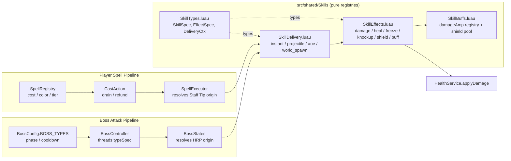
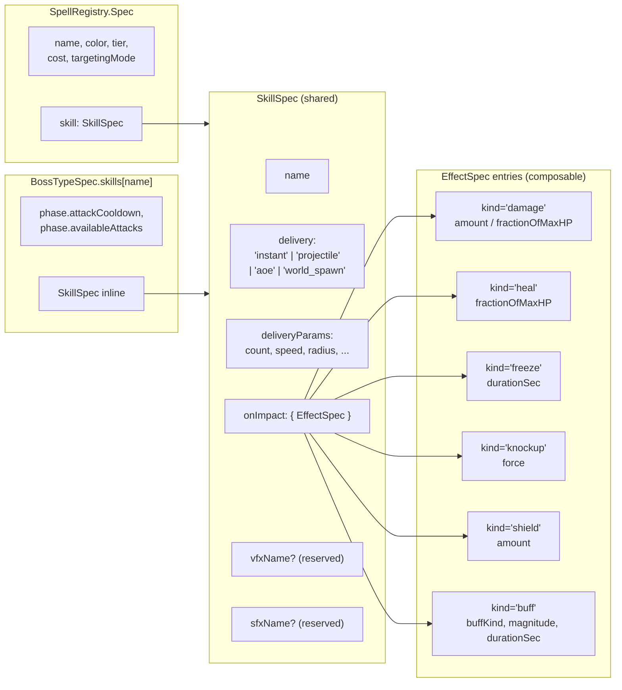
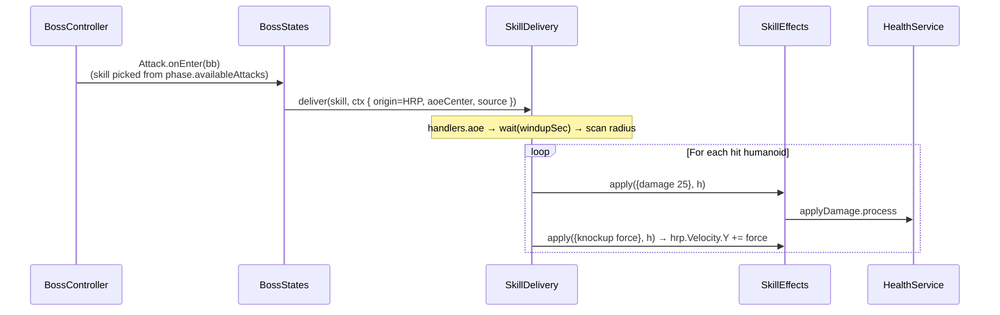
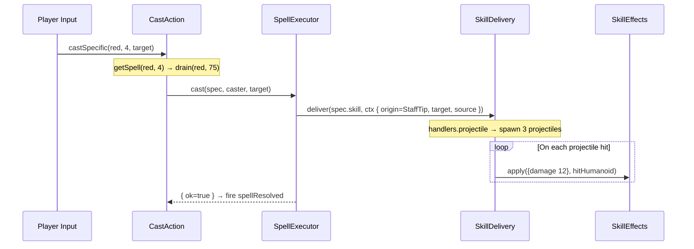
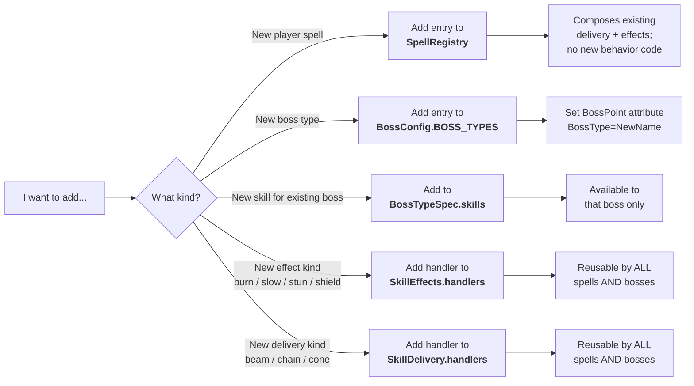

# Skill Pipeline

A unified data + dispatch pipeline shared by **player spells** and **boss attacks**. Every "thing that does combat" — a spell, a boss skill, a future NPC ability — is described by the same `SkillSpec` data shape and executed by the same two registries.

Shipped in commit `03b6080` (replaces the old boss-only `BossAttacks.luau` and the inline dispatch in `SpellExecutor`).

## TL;DR

- **`SkillSpec`** = pure data: `{ delivery, deliveryParams, onImpact: { EffectSpec } }`
- **`SkillDelivery`** = how the skill reaches its target (`instant`, `projectile`, `aoe`, `world_spawn`)
- **`SkillEffects`** = what happens on impact (`damage`, `heal`, `freeze`, `knockup`, `shield`, `buff` — all real as of Phase 5.2; the `wall` stub was deleted, see [Defensive layer](#defensive-layer-shield--buff--wall-phase-52))
- **Wrappers** ([[systems/SpellRegistry]], `BossConfig.BOSS_TYPES`) add context-specific fields (cost/color/tier or phase/cooldown)
- Adding a new effect kind once makes it available to every spell and every boss attack — no caller changes

## Architecture

```mermaid
graph LR
    subgraph Player["Player Spell Pipeline"]
        direction TB
        SR["SpellRegistry<br/>cost / color / tier"]
        CA["CastAction<br/>drain / refund"]
        SE["SpellExecutor<br/>resolves Staff Tip origin"]
        SR --> CA --> SE
    end

    subgraph Shared["src/shared/Skills (pure registries)"]
        direction TB
        ST["SkillTypes.luau<br/>SkillSpec, EffectSpec, DeliveryCtx"]
        DR["SkillDelivery.luau<br/>instant / projectile / aoe / world_spawn"]
        ER["SkillEffects.luau<br/>damage / heal / freeze / knockup / shield / buff"]
        BR["SkillBuffs.luau<br/>damageAmp registry + shield pool"]
        ER --> BR
        ST -.types.-> DR
        ST -.types.-> ER
        DR --> ER
    end

    subgraph Boss["Boss Attack Pipeline"]
        direction TB
        BC["BossConfig.BOSS_TYPES<br/>phase / cooldown"]
        BCT["BossController<br/>threads typeSpec"]
        BST["BossStates<br/>resolves HRP origin"]
        BC --> BCT --> BST
    end

    SE --> DR
    BST --> DR
    ER --> HS["HealthService.applyDamage"]
```

The registries are **pure**: they never branch on caster type, don't know about staffs vs boss rigs, don't touch cost or cooldown. Each caller ([[systems/SpellExecutor]], `BossStates`) resolves its own context (origin CFrame, source instance) and passes it via `DeliveryCtx`.

Every effect and delivery handler is real as of Phase 5.2. The refund path that Phase 5.1 built for stubs is still load-bearing — [[systems/CastAction]] drains before executing, so any genuine rejection (a targeted spell cast with no target, an unknown effect kind) hands the mana back rather than charging for a no-op.

## Data Shape

```mermaid
graph LR
    subgraph PlayerWrapper["SpellRegistry.Spec"]
        W1["name, color, tier,<br/>cost, targetingMode"]
        S1["skill: SkillSpec"]
    end

    subgraph BossWrapper["BossTypeSpec.skills[name]"]
        W2["phase.attackCooldown,<br/>phase.availableAttacks"]
        S2["SkillSpec inline"]
    end

    subgraph SkillCore["SkillSpec (shared)"]
        SN["name"]
        SD["delivery:<br/>'instant' | 'projectile'<br/>| 'aoe' | 'world_spawn'"]
        SDP["deliveryParams:<br/>count, speed, radius, ..."]
        SOI["onImpact: { EffectSpec }"]
        SVF["vfxName? (reserved)"]
        SSF["sfxName? (reserved)"]
    end

    subgraph Effects["EffectSpec entries (composable)"]
        E1["kind='damage'<br/>amount / fractionOfMaxHP"]
        E2["kind='heal'<br/>fractionOfMaxHP"]
        E3["kind='freeze'<br/>durationSec"]
        E4["kind='knockup'<br/>force"]
        E5["kind='shield'<br/>amount"]
        E6["kind='buff'<br/>buffKind, magnitude, durationSec"]
    end

    S1 --> SkillCore
    S2 --> SkillCore
    SOI --> E1
    SOI --> E2
    SOI --> E3
    SOI --> E4
    SOI --> E5
    SOI --> E6
```

`onImpact` is an **array** — a single skill can apply multiple effects in sequence (e.g., GroundSlam does damage + knockup). Sanctuary is `{ heal, shield }` again as of 5.2; its `shield` entry had been removed in 5.1 because a failing stub after a *real* full heal would have triggered the refund path, making it a free full heal.

## Execution Flow — Boss GroundSlam

```mermaid
sequenceDiagram
    participant Ctrl as BossController
    participant States as BossStates
    participant DR as SkillDelivery
    participant ER as SkillEffects
    participant HS as HealthService

    Ctrl->>States: Attack.onEnter(bb)<br/>(skill picked from phase.availableAttacks)
    States->>DR: deliver(skill, ctx { origin=HRP, aoeCenter, source })
    Note over DR: handlers.aoe → wait(windupSec) → scan radius
    loop For each hit humanoid
        DR->>ER: apply({damage 25}, h)
        ER->>HS: applyDamage.process
        DR->>ER: apply({knockup force}, h) → hrp.Velocity.Y += force
    end
```

## Execution Flow — Player Casts Volley (boss skill exposed as a spell)

```mermaid
sequenceDiagram
    participant P as Player Input
    participant CA as CastAction
    participant SE as SpellExecutor
    participant DR as SkillDelivery
    participant ER as SkillEffects

    P->>CA: castSpecific(red, 4, target)
    Note over CA: getSpell(red, 4) → drain(red, 75)
    CA->>SE: cast(spec, caster, target)
    SE->>DR: deliver(spec.skill, ctx { origin=StaffTip, target, source })
    Note over DR: handlers.projectile → spawn 3 projectiles
    loop On each projectile hit
        DR->>ER: apply({damage 12}, hitHumanoid)
    end
    SE-->>CA: { ok=true } → fire spellResolved
```

**Note**: this is the exact same `SkillDelivery.handlers.projectile` that the boss's FireballVolley uses. The only difference is the origin (Staff Tip vs Boss HRP) and the wrapping context (SpellRegistry adds cost; BossConfig adds phase).

### Projectile detonation model (2026-08-03)

A projectile is a physics `Part` on a straight `LinearVelocity` — it never curves after launch (`trackTarget` only re-resolves the aim point at each staggered *launch*). Every Heartbeat it checks four detonation causes, in this order, and all four route through one `detonate()` closure:

| Cause | Trigger | Fixes |
|---|---|---|
| `expiry` | `lifetimeSec` elapsed | splash spells no longer vanish silently at end of flight |
| `impact` | swept ray over this frame's step hits world geometry or a rig limb | projectiles stop at cover instead of flying through it; also closes the tunnelling gap — at Fireball's 55 studs/s a >54 ms frame steps clean over the 3-stud shell |
| `proximity` | any hittable's HRP within `proximityRadius` | the original (and only) check |
| `fuze` | closest approach to `ctx.target` while inside `impactRadius` — splash spells only | **the actual fix for "Fireball sometimes does no damage"** |

The `fuze` is the load-bearing one. Because the shot is aimed where the target stood at launch, a target strafing during a ~1 s flight is routinely missed by the 3-stud shell while still well inside a 7-stud blast radius — and `expiry` doesn't save it, since a Fireball outruns its target by ~80 studs before the timer runs out. Fuzing at closest approach converts those near-misses into full splash damage. It is deliberately restricted to `ctx.target` so a bystander near the muzzle can't detonate the shot as it leaves the staff.

When `impactRadius == 0` (Firebolt, Volley, both boss FireballVolleys) the fuze is off and only a direct hit damages — `expiry` and a wall `impact` deal nothing, they just stop the Part.

**Behaviour change to know about**: projectiles are now blocked by cover, boss attacks included. `RaycastParams.RespectCanCollide = true` keeps shockwaves, VFX parts, and other decorative non-collidable geometry from eating shots; the caster and the projectile itself are excluded from the ray. Verified in-playtest: a 5-stud miss deals 20 damage, a 10-stud miss deals 0, a rig 3 studs behind a wall takes splash, a rig 29 studs behind takes nothing.

## Registry Lifecycle & Death Cleanup (Phase 5.1)

Both per-Humanoid registries (`SkillEffects._freezeState`, `SkillInterrupt._active`/`_silenced`) used to be cleaned only by their happy timer/finish paths — a humanoid that died or despawned mid-freeze (or mid-cast) leaked its entries forever, including orphaned FreezeVfx ice shards. Since 5.1 each registry installs one-shot cleanup connections the first time a humanoid is tracked:

- **`Humanoid.Died`** — real character deaths (players, NPCs, boss).
- **`Humanoid.HealthChanged <= 0`** — backup for `Died`: the Dead state transition never fires on partial/synthetic rigs (verified empirically — even `ChangeState(Dead)` with a neck Motor6D sticks in `FallingDown`). Purges are idempotent, so both firing is harmless.
- **`Humanoid.Destroying`** — despawns without death. Note the place runs **deferred signal behavior**: handlers run at the next resumption point, never synchronously — anything observing a purge must poll, not assert inline.

`SkillEffects.isFrozen(target)` is a read-only probe added for tests/diagnostics. On purge, freeze restores WalkSpeed only on the timer path (`purgeFreeze(h, true)`); death/despawn paths skip the write and still stop FreezeVfx and unsilence.

## Defensive layer: shield / buff / wall (Phase 5.2)

The three Phase 5.1 stubs resolved into **two** real effects and one deletion. What the roster actually needed was not what the stub names suggested:

| Stub | Outcome | Why |
|---|---|---|
| `shield` | **Real effect.** Grants a flat absorb pool. | Blue T2 Shield and Green T3 Sanctuary both want it. |
| `buff` | **Real effect.** Timed stat modifier, keyed by `buffKind`. | Its first consumer is Stasis's damage amp — which the registry had been declaring as `freeze.damageAmpMultiplier` while the freeze handler silently ignored it. |
| `wall` | **Deleted.** | Nothing ever used it. Stone Wall is a `world_spawn` *delivery* with an empty `onImpact` — the Part is the effect. The effect handler was a decoy. |

### Shield — ownership splits across two systems

The absorb pool lives in the character Model's `_shield` attribute, **not** in a Skills-local table, because [[systems/Health]]'s `DamageModifierRegistry.shieldModifier` already reads and drains that attribute inside `applyDamage.process` — the exact path boss attacks take. Storing it anywhere else would mean reimplementing absorption on a path that already has it.

So ownership splits deliberately, and this is the one place it's allowed to:

- **Skills grants** the pool (`SkillBuffs.grantShield`) — additive, so Sanctuary layered on Shield is worth both.
- **Health drains** it (`DamageModifierRegistry.shieldModifier`).
- Nothing else writes the attribute.

The pool has **no expiry** (design call 2026-08-03): it lasts until damage eats it or the holder dies. That makes death cleanup the only thing standing between it and an indefinite leak, so `SkillBuffs` installs the same `Died` / `HealthChanged<=0` / `Destroying` hooks the other registries use. Give it a duration in `SpellRegistry` if playtest says it overstays.

**The shield only works where `applyDamage` runs — the server.** A client-set attribute never replicates upward, so an unrelayed shield protects nothing. See [Self-cast relay](#self-cast-relay) below.

### Buffs — lazy expiry

`SkillBuffs` stores timed modifiers per Humanoid and evaluates expiry **on read**, not on a timer. An expired entry on a living humanoid is harmless (filtered at read) and bounded by the number of buff kinds, while death and despawn are covered by purge — which removes a whole class of timer/death races of the kind 5.1 had to fix for freeze. Re-applying the same `buffKind` overwrites rather than stacks, so re-casting Stasis refreshes the window instead of squaring the multiplier.

`SkillEffects.damage` multiplies by `SkillBuffs.damageAmp(target)` once, ahead of the branch, so all three damage paths (applyDamage, MaxHP fraction, flat) honour it identically.

### Stone Wall — server-only spawn

`world_spawn` places an anchored, collidable slab via `SkillVisuals.spawnBarrier` and lets `Debris` clean it up after `durationSec`. It collides with **everything, including the caster** (design call 2026-08-03): a wall you can walk through but the boss can't reads as broken, and being able to box yourself in is what makes placement a decision.

The handler is server-only. A Part created on a client is local to that client — it wouldn't block the server-owned boss, and the server's copy replicates down anyway, so spawning on both would double the wall. The client branch returns `ok=true` so CastAction doesn't refund a cast the server is about to honour.

Two gotchas worth keeping:

- The wall's facing comes from the caster's **HumanoidRootPart**, not `ctx.origin` — origin is the staff Tip attachment, whose LookVector tracks wherever the weapon is swung rather than where the player is looking.
- The base is settled onto the floor with a downward raycast using `RespectCanCollide = true`. Without it the probe stops on the arena's non-collidable trigger volumes (`SpawnZoneBox`, block spawn volumes) and the wall hovers ~9 studs up with a gap the boss walks straight under. Caught in playtest 2026-08-03.

**Still outstanding:** there is no placement reticle. `world_spawn` accepts a `Vector3` target when one is supplied, but the cast UI passes `nil`, so a Stone Wall currently drops a fixed 12 studs ahead of the caster's facing. The reticle UX is Phase 5.3 ([[design/gameplay-loop]] § Targeting describes the intended ⌖ marker).

### Self-cast relay

Self-buffs and placement spells now relay to the server too. Before 5.2 the cast UI decided self-vs-enemy targeting **by colour** — "green means self" — which broke the moment a self-buff shipped in another school: blue Shield demanded an enemy in range and passed *that enemy* as the target, so a naive shield would have shielded the boss.

The rule now lives in the registry:

- `SpellRegistry.Spec.selfTarget: boolean?` marks caster-resolved spells (Mend, Shield, Sanctuary).
- `SpellRegistry.needsEnemyTarget(spec)` is the single predicate — false for self-buffs *and* placement spells. Nothing should branch on colour again.
- `CastAction.resolveTapSpec(color, reservoirs)` lets the HUD see which spell a tap will fire *before* casting, so it knows whether to hunt for a target. Keeping the selection rule in CastAction stops the HUD drifting from what `tapReservoir` actually picks.

`SpellCastService` accepts `target = nil` and validates it against `needsEnemyTarget` — a targeted spell arriving with no target is rejected as malformed. This is still client-trusted overall (the client picks the spell and the server takes its word on affordability); Phase 5.4 is where that gets validated.

### Damage paths — decision (2026-07-27)

`SkillEffects` writes `Humanoid.Health` directly for player spells while boss attacks route through `applyDamage.process`. This split stays for now: **hit zones/damage modifiers are out of scope for spells**. `applyDamage` lives in `ServerScriptService` (server-only) while player spells execute client-side, so real unification means moving casting server-side — which is exactly what Phase 5.4's server-trust hardening does. Unify then, not before.

## Testing

- `src/shared/Skills/__tests.luau` — smoke suite (`.run()` harness): token lifecycle, cancel/finish, silence/unsilence, all four death/despawn purge races, plus the 5.2 defensive scenarios (shield absorb through `DamageModifierRegistry`, additive stacking + death purge, damageAmp multiplication, lazy buff expiry). 11 scenarios.
- `src/shared/Tests/Suites/Skills/` — autorunner suite (`workspace:SetAttribute("RunTests", "Skills")`): wraps the smoke suite plus `SpellExecutor.__tests`, `CastAction.__tests`, and `cast_refund_on_failure`. 4/4 as of 2026-08-03.

`cast_refund_on_failure` replaces 5.1's `stub_cast_refunds`, which drove the refund path through the shield stub. With the stubs gone it drives the same drain → refuse → refund guarantee through a genuine rejection instead (Frost Nip cast with no target).

The shield-absorb scenario is the load-bearing one: it asserts that Skills and Health still agree on where the pool lives. If they ever diverge, the shield silently stops working and nothing else notices.

## Where Do I Add New Content?

```mermaid
graph LR
    Start[I want to add...] --> Q{What kind?}
    Q -->|New player spell| A1[Add entry to<br/><b>SpellRegistry</b>] --> Done1["Composes existing<br/>delivery + effects;<br/>no new behavior code"]
    Q -->|New boss type| A2[Add entry to<br/><b>BossConfig.BOSS_TYPES</b>] --> Done2["Set BossPoint attribute<br/>BossType=NewName"]
    Q -->|New skill for existing boss| A3[Add to<br/><b>BossTypeSpec.skills</b>] --> Done3["Available to<br/>that boss only"]
    Q -->|New effect kind<br/>burn / slow / stun / shield| A4[Add handler to<br/><b>SkillEffects.handlers</b>] --> Done4["Reusable by ALL<br/>spells AND bosses"]
    Q -->|New delivery kind<br/>beam / chain / cone| A5[Add handler to<br/><b>SkillDelivery.handlers</b>] --> Done5["Reusable by ALL<br/>spells AND bosses"]
```

## Module Reference

| Path | Role | Owns |
|---|---|---|
| `src/shared/Skills/SkillTypes.luau` | Pure types | `SkillSpec`, `EffectSpec`, `DeliveryCtx` |
| `src/shared/Skills/SkillEffects.luau` | Effect handlers | `apply(spec, target, source)`, `isFrozen(target)`, `handlers.{damage, heal, freeze, knockup, shield, buff}`, freeze death-cleanup |
| `src/shared/Skills/SkillBuffs.luau` | Per-Humanoid status registry | `applyBuff`, `damageAmp`, `hasBuff`, `grantShield`, `getShield`, `purge`; owns the `_shield` grant side and buff death-cleanup |
| `src/shared/Skills/SkillDelivery.luau` | Delivery handlers | `deliver(skill, ctx)`, `handlers.{instant, projectile, aoe, world_spawn}` |
| `src/shared/Skills/SkillVisuals.luau` | Shared visual primitives | `spawnShockwave` (cosmetic), `spawnBarrier` (the Stone Wall body — the only collidable primitive here) |
| `src/shared/Skills/SkillInterrupt.luau` | Per-Humanoid cast interrupt registry | `begin(caster)`, `finish(caster, token)`, `cancelCastsBy(target)`, `silence(target)`, `unsilence(target)`, death-cleanup hooks |
| `src/shared/Skills/__tests.luau` | Smoke suite | Token lifecycle, death/despawn purge races, shield + buff scenarios (`.run()`) |
| `src/shared/SpellRegistry/init.luau` | Player spell wrapper | `Spec { name, color, tier, cost, targetingMode, selfTarget?, skill }`, `needsEnemyTarget(spec)` |
| `src/shared/SpellExecutor/init.luau` | Player cast entry | `cast(spec, caster, target)`, `resolveSpellOrigin(caster)` |
| `src/shared/CastAction/init.luau` | Player resource gate | drain → cast → refund |
| `src/shared/Boss/BossConfig.luau` | Boss type registry | `BOSS_TYPES`, `DEFAULT_TYPE` |
| `src/shared/Boss/BossTypes.luau` | Boss wrapper types | `BossTypeSpec`, `PhaseSpec`, `BossBlackboard` |
| `src/server/Boss/BossService.server.luau` | Boss lifecycle | Resolves type from `BossPoint:GetAttribute("BossType")` |
| `src/server/Boss/Scripts/BossController.luau` | Per-boss controller | Owns blackboard, threads typeSpec |
| `src/server/Boss/Scripts/BossStates.luau` | Boss FSM + cast dispatch | Resolves HRP origin, calls `SkillDelivery.deliver` |

## Reserved Hooks (not yet implemented)

The schema includes fields handlers currently ignore. They will activate when their backing systems land:

- `SkillSpec.vfxName: string?` — fires named VFX on cast/impact (blocked on [[systems/VisualEffects]] Phase C: VfxController)
- `SkillSpec.sfxName: string?` — plays named SFX on cast/impact (blocked on SFX module — no system exists yet, see [[systems/AudioSFX]])
- `DeliveryCtx.target: Vector3` for `world_spawn` — the handler honours an explicit placement point, but no cast UI supplies one yet (blocked on the placement reticle, Phase 5.3)

Retired from this list in 5.2: `shield` and `buff` are real handlers; `wall` was deleted outright (nothing consumed it — Stone Wall is a delivery, not an effect).

Adding these later requires **only** wiring the handlers — no schema changes, no caller changes.

## VFX Layers

Three distinct VFX runtimes coexist. Knowing which lane a new visual belongs in is upstream of the SingleOwnership rule — each lane has a separate spawn site, lifetime model, and reason for being.

| Lane | Spawn site | Lifetime | Use when… |
|---|---|---|---|
| **Burst VFX** | `VfxController` clones from `VfxConfig.EFFECTS` via `Shared/Vfx/spawnEffect.luau` | Fire-and-forget; `totalDurationSec` from the EffectSpec | The visual is a one-shot particle burst at cast (staff tip) or impact (target HRP). |
| **Status visuals** | `SkillEffects.handlers.<kind>` invokes a module under `src/shared/Vfx/StatusVisuals/` (e.g. `FreezeVfx`) | Persistent welded geometry, lives for the duration of the active status; cleanup is reciprocal (`start` + `stop`) | The effect is a persistent body decoration (ice shards, burn marks, poison cloud) that must follow limbs and survive a multi-second status. Burst particles can't carry these semantics. |
| **Delivery visuals** | Inline in `SkillDelivery.handlers.{projectile, aoe}` — the physical `Part` is the visual | Tied to the physics object (`Debris:AddItem`) | The visual IS the gameplay object (the projectile body, the shockwave geometry). For cosmetic upgrades (trail/glow/sound) on top, set `deliveryParams.cosmeticEffectId` and the handler attaches the corresponding `VfxConfig.EFFECTS` entry to the moving Part — physics still lives in `SkillDelivery`, the *cosmetic* layer routes through `VfxConfig`. |

Color source is shared across all three lanes: `VfxConfig.COLORS.{red,green,blue}.{primary,glow,accent}`. Status visuals and delivery visuals should never hardcode a `Color3` — pull from the palette so a future red/blue retheme touches one table.

Cross-client replication: only burst VFX replicate (via `BroadcastSpellVfx` → `SpellVfxEvent`). Delivery visuals are local to the firing client; status visuals are local to whichever VM ran the `freeze` handler. Replicating the latter two is a follow-up if/when it matters for gameplay readability.

## Modularity Invariants

These are load-bearing. If you find yourself wanting to violate one, stop and reconsider the design:

1. **Registries are pure.** No branching on caster type, no knowledge of staffs / boss rigs / cost / cooldown.
2. **Origin is caller-resolved.** Callers compute `DeliveryCtx.origin` and pass it in. The delivery handler never asks "is this a Player?"
3. **`SkillSpec` is data-only.** No functions, no behavior. Wrappers add context-specific fields outside `SkillSpec`.
4. **`onImpact` is an array.** Multi-effect skills compose by listing entries. No nested effect specs. **`VfxController` plays one impact burst per unique `kind`** in the array, so multi-effect spells (GroundSlam `{ damage, knockup }`, Sanctuary `{ heal, shield }`, Stasis `{ freeze, buff }`) render layered VFX.
5. **Single-write ownership.** Only `SkillEffects.handlers.freeze` writes to `Humanoid.WalkSpeed` for freeze. Only `SkillDelivery.handlers.projectile` spawns projectiles. Only `SkillInterrupt` owns the per-Humanoid cast-token registry that gates async delivery work. Only `SkillBuffs` grants the `_shield` pool and only `DamageModifierRegistry` drains it — the one deliberate cross-system split, documented above. See [[concepts/SingleOwnership]].
7. **Targeting is registry-declared, never colour-inferred.** Ask `SpellRegistry.needsEnemyTarget(spec)`. The colour heuristic it replaced ("green means self") silently broke the first self-buff that shipped outside green.
6. **VFX color flows through `VfxConfig.COLORS`.** No `Color3.fromRGB(…)` literals in status visuals or delivery visuals; pull from the palette. Burst VFX entries declare `color = C.<color>` in their `EmitterSpec`.

## See also

- [[systems/SpellRegistry]] — player spell wrapper (cost / color / tier)
- [[systems/SpellExecutor]] — thin adapter that resolves origin and delegates to SkillDelivery
- [[systems/CastAction]] — drain → cast → refund pipeline for player spells
- [[systems/Boss]] — boss attacks dispatched through the same pipeline
- [[systems/Health]] — `applyDamage.process` path used by damage effects
- [[systems/VisualEffects]] — VFX system that will consume `SkillSpec.vfxName`
- [[systems/AudioSFX]] — SFX inventory; future SFX module will consume `SkillSpec.sfxName`
- [[concepts/SingleOwnership]] — the invariant that keeps registry handlers conflict-free
