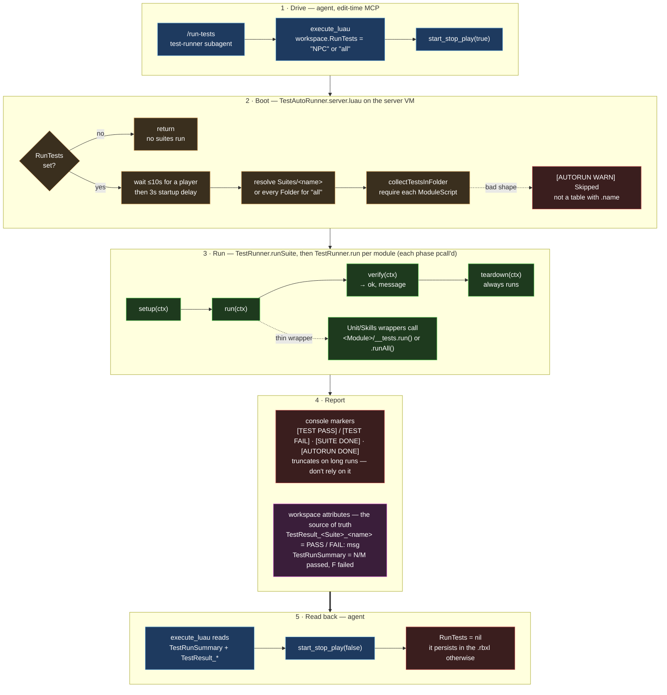

# Test System

Lightweight in-Studio test harness for gameplay systems. Tests run inside Studio (not as unit tests outside the engine) so they can exercise real Humanoid / Tool / Animation behavior — including the pure-Luau modules, which could run standalone but are wired in here anyway so one `RunTests="all"` catches everything.

## Pipeline at a glance



Read the diagram top to bottom. The agent side (blue) only touches one attribute and the play button; everything in the middle runs on the server VM, which is why a suite can `require` server modules directly but can never see `Players.LocalPlayer`. The result path to trust is the thick edge: attributes, not the console. Unfamiliar terms (workspace attribute, VM, `ctx`, wrapper…) are defined in § Glossary at the bottom of the page.

## Files

```
src/shared/Tests/
  TestRunner.luau               — generic test runner (declares, runs, reports)
  Helpers/
    ensurePatroller.luau         — NPC suite fixture: reuse-or-clone Patroller_1
    restoreToSafeSpawn.luau      — teardown-only: put a moved player back on solid ground
  Suites/
    NPC/
      combat_engages.luau
      combat_disengages.luau
      npc_deals_damage.luau
    Multiplayer/
      multiplayer_invariants.luau
      pve_intermission_returns_roster_to_lobby.luau
      pve_round_ends_on_boss_defeated.luau
      pve_round_ends_on_empty_roster.luau
      registry_views_agree.luau · sessions_isolate_scores.luau
      transfer_moves_roster_and_attributes.luau
    Phase3/
      blockspawner_{fills_to_target,autorefills,bounds_check,respawn_delay}.luau
      blockshoot_helpers.luau · blockshoot_remote_exists.luau · phase3_invariants.luau
    Skills/
      castaction_tests.luau · spellexecutor_tests.luau · skillinterrupt_smoke.luau
      cast_rejected_before_drain.luau · predicted_run_writes_nothing.luau
    Hardening/
      blockshoot_payload_validation.luau · blockshoot_range_and_rate.luau
      blockshoot_arena_match.luau · spellcast_payload_validation.luau
    Economy/
      ledger_prices_a_cast.luau · ledger_refuses_over_cap_memorize.luau
      ledger_resets_on_round_start.luau
    Unit/
      wordbuffer_tests.luau · energyeconomy_tests.luau · energyreservoirs_tests.luau
      dictionary_tests.luau · spellregistry_tests.luau · memorizeaction_tests.luau
      mindfullmanager_tests.luau · hud_tests.luau

src/server/Tests/
  TestAutoRunner.server.luau    — invoked at boot when a workspace flag is set, runs a named suite, prints results
```

`Suites/Melee/` was deleted in the 2026-09 refactor (chunk 1) — the melee chain is dead code (chunk 11 removes the modules it exercised). `Helpers/restoreToSafeSpawn.luau` was deleted alongside it in the same pass (its only callers at the time were the Multiplayer suite files removed with it), then **recovered verbatim** during chunk 1's parent-review follow-up once the NPC suites needed the exact same "put the player back on solid ground" fixture it already implemented — see `combat_disengages` in Fixture requirements below.

## Discovery rules

`TestAutoRunner.server.luau` is a server-only Script. At boot it reads `workspace:GetAttribute("RunTests")`:

- unset / empty string → the script returns immediately, no suites run.
- a suite folder name (e.g. `"NPC"`) → requires every `ModuleScript` directly under `ReplicatedStorage.Shared.Tests.Suites.<name>` and runs them as one suite.
- `"all"` → does that for every `Folder` directly under `Suites`.

A child is only counted as a test if `require`ing it succeeds AND the result is a table with a `.name` field. Anything else (a stray non-ModuleScript, or a ModuleScript that doesn't return the right shape) logs `[AUTORUN WARN] Skipped <name>: ...` and is dropped from the suite silently — **this chunk's whole point was to get that WARN count to zero**, because a silently-skipped test used to read as a passing suite. A `RunTests="all"` run with any `[AUTORUN WARN] Skipped` line means something in `Suites/` isn't wired right, not that everything is fine.

Because the autorunner only ever runs server-side, **any suite requiring `Players.LocalPlayer` cannot execute through it** — see `hud_tests` below.

Timing: the autorunner waits up to `PLAYER_WAIT_TIMEOUT` (10s) for a player, then `STARTUP_DELAY_SECONDS` (3s) for world + NPC boot, then runs. Budget ~25s from play-start before reading results.

## Test module shape

`TestRunner.run` executes one module as `setup → run → verify → teardown`, sharing a `ctx` table (`ctx.player` is the first player). Every phase is optional: a module with only `verify` is a structural-invariant check; a module with only `run` passes unless `run` throws. Each phase runs under `pcall`, and `teardown` always runs. `TestRunner.runSuite` prints `[TEST PASS]` / `[TEST FAIL]` per test and `[SUITE DONE]` per suite; the autorunner adds `[AUTORUN START]` / `[AUTORUN DONE]` around the whole run.

**Read results from attributes, not the console.** After each suite the autorunner writes `workspace.TestResult_<Suite>_<sanitised name>` (`"PASS"` or `"FAIL: <message>"`, names reduced to `[A-Za-z0-9_]`) and, at the end, `workspace.TestRunSummary` (`"N/M passed, F failed"`). Studio's console truncates the tail of long playtests; the attributes survive until play-stop.

## `__tests.luau` wiring — two idioms

Every gameplay module with its own `src/shared/<Module>/__tests.luau` gets a thin wrapper ModuleScript under `Suites/Skills/` or `Suites/Unit/` with this shape:

```lua
return {
	name = "some_tests",
	run = function(_ctx) require(ReplicatedStorage.Shared.<Module>:FindFirstChild("__tests")).run() end,
}
```

`TestRunner.run` treats a wrapper with no `verify` as "passed unless `run` throws" — so the `__tests` module itself must throw (via `error`/`assert`) on any failed case, and simply return normally on success. This is the idiom `CastAction`, `Dictionary`, `EnergyEconomy`, `EnergyReservoirs`, `MemorizeAction`, `MindFullManager`, `Skills` and `WordBuffer`'s `__tests.luau` all use — exposing `M.run()` (or, for `WordBuffer`, `{ run = runTests }`).

`SpellExecutor` and `SpellRegistry` use the other idiom: their `__tests.luau` exposes `.runAll()` returning `(passed, failed)` counts instead of throwing, because their case tables run every case even after one fails (so one bad case doesn't hide the rest). Their wrappers (`spellexecutor_tests.luau`, `spellregistry_tests.luau`) capture the tuple into `ctx` in `run` and check `failed == 0` in `verify`. **Don't force these into the throw-on-fail idiom** — the tuple form is deliberate (see `SpellExecutor.__tests.luau`'s own header comment).

Requiring any `__tests.luau` must be side-effect-free — the assertions only run inside `.run()`/`.runAll()`. Two modules got this wrong before the 2026-09 refactor (chunk 1): `Dictionary` and `EnergyEconomy` executed their asserts at the top level, so merely `require`ing them (e.g. from another script, or Rojo's own instantiation) would throw. Both are now wrapped. `WordBuffer.__tests` returned a bare function instead of a table — also fixed, since the autorunner's `collectTestsInFolder` only accepts a table with `.name`.

## Fixture requirements

- **NPC suites** need a live, ticking `workspace.Patroller_1` with a real `NPCController` behind it — not just the raw rig Model. `NPCService.server.luau` boot-spawns one from `ServerStorage.AIWorldData` spawn points before `TestAutoRunner`'s startup delay elapses, which is the fixture in the common case. `Helpers/ensurePatroller.luau` is the fallback: if no `Patroller_1` exists, it clones `ServerStorage.AIWorldData.Rigs.Patroller`, constructs an `NPCController` directly (the same module `NPCService` uses — it's a requireable ModuleScript, not locked inside the Script), and ticks it on `Heartbeat` for the test's duration. `teardown` only tears down what it created; a boot-spawned `Patroller_1` is never touched, since it's shared state other systems (and other tests in the same `"all"` run) depend on.
- **`combat_disengages` teardown restores the player to solid ground.** It deliberately teleports the player 80 studs from the NPC (`FAR_OFFSET`) to exercise the disengage transition, which can land them over open air and into `Workspace.Arena.DeathZone`. `teardown` calls `Helpers/restoreToSafeSpawn.luau` unconditionally so a following test doesn't inherit a mid-fall or mid-DeathZone-relocation character. `npc_deals_damage`'s `setup` additionally polls (bounded to 8s) for the player's Humanoid to hold `Health >= MaxHealth` for a continuous 1s window before doing anything else — belt-and-braces against any other test in the suite leaving the player unsettled, restarting the window on a mid-wait respawn (Humanoid identity change) and failing `setup` with a clear reason if it never stabilises.
- **Hardening suite** drives `BlockShootValidation` / `SpellCastValidation` directly rather than firing the remotes, because the most important input — a table wearing a Model's property names — cannot be sent from a test that already runs on the server. These modules live under `ReplicatedStorage.Shared.Tests` but reach into `ServerScriptService.Server.*`, which is valid because `TestAutoRunner` is a server Script. `blockshoot_arena_match` (chunk 9) additionally needs a live `BlockSpawner` pool to confirm spawned blocks carry their `ArenaId` attribute.
- **Economy suite** drives `EnergyLedger` directly for the same reason — the payloads under test are ones a well-behaved client cannot send — and keys by UserId so a test can stand in for a player with no `Players` entry. `ledger_resets_on_round_start` is the exception: it fires the real round-start `BindableEvent`, because the missing wiring was the bug it guards.
- **Multiplayer session tests** (chunk 8) work with exactly one real Player. `sessions_isolate_scores` and `transfer_moves_roster_and_attributes` create a throwaway session/arena, move the harness player through `SessionRegistry.transferPlayer`, and move them back in `teardown`. The transfer really pivots the character — that is the behaviour under test, so don't expect the player to stay put during an `"all"` run.
- **`hud_tests` (Unit)** is VM-gated, not fixture-gated: `Hud/__tests.luau` requires `Players.LocalPlayer` and errors immediately on a server VM (see its own "Client only" header). Since there is no client-side autorunner, `Suites/Unit/hud_tests.luau` checks `RunService:IsServer()` and reports an explicit pass with a `"skipped — client-only ..."` message instead of a false `[TEST FAIL]` for a harness gap. On an actual client VM it runs the real `HudGate` suite.

## Suite table

| Suite | Status | Covers |
|---|---|---|
| NPC | LIVE (fixture-gated via `ensurePatroller`) | Combat engage/disengage state transitions, NPC-deals-damage — [[systems/NPC]] |
| Multiplayer | LIVE (7 tests) | `multiplayer_invariants` — boot-time structure: GameMode remotes, PlayerDamaged/PlayerEliminated events; `registry_views_agree`, `sessions_isolate_scores`, `transfer_moves_roster_and_attributes` — [[systems/GameMode]] SessionRegistry views, per-session ScoreTracker, roster + attribute transfer (chunk 8); `pve_round_ends_on_boss_defeated`, `pve_round_ends_on_empty_roster`, `pve_intermission_returns_roster_to_lobby` — Phase 6 stage 5: the `BossDefeated` objective, the emptied-roster end, and the intermission → lobby hook, all through the real round loop (the last one waits out the real 10 s intermission, ~16 s) |
| Phase3 | LIVE (7 tests) | BlockSpawner pool/refill/bounds/respawn-delay, BlockShoot helpers/remote — [[systems/BlockShoot]] |
| Skills | LIVE (5 tests) | SkillInterrupt lifecycle, SpellExecutor case table, CastAction scenarios, cast-rejection, predicted-vs-authoritative |
| Hardening | LIVE (4 tests) | [[systems/BlockShoot]] § Trust model (payload, range/rate, arena match), [[systems/SpellCastService]] § Trust model |
| Economy | LIVE (3 tests) | [[systems/EnergyEconomy]] ledger: prices a cast, refuses over-cap memorize, resets on round start (ENFORCE=true since chunk 6) |
| Unit | LIVE (8 tests) | WordBuffer, EnergyEconomy, EnergyReservoirs, Dictionary, SpellRegistry, MemorizeAction, MindFullManager (all real runs) + Hud (server-VM skip, real on client) |
| Melee | **deleted** (chunk 1, 2026-09-08) | Was: MeleeHitDetector sweep. Dead code — [[systems/Weapon]] melee path is unused; chunk 11 removes the modules |

**37 tests total.** `RunTests="all"` last verified 34/34 on 2026-09-11 (chunk 10 playtest, see [[log]]); the three `pve_*` tests added 2026-09-19 have run as `RunTests="Multiplayer"` (7/7), not yet inside an `"all"` run. Any other total means a suite folder lost or gained a module — check for `[AUTORUN WARN] Skipped` lines first.

Deleted alongside Melee: `Suites/Multiplayer/{drop_request_zone_gated,respawnzone_tracks_hrp_presence,applydamage_credits_bot_kill}.luau` (their C1/C2 deliverables and the bot-spawner they exercised are gone — see `wiki/design/refactor-plan-2026-09.md` Chunk 0/1). `Helpers/restoreToSafeSpawn.luau` was deleted in the same pass (its only caller at the time was `respawnzone_tracks_hrp_presence`) but recovered days later — see § Files above.

## Stale-assertion pitfall: check a test's claims against the code, not just its name

A `RunTests="all"` failure is not automatically a live regression — a test's own assertion can go stale when the thing it checks for is deliberately deleted or extended elsewhere. Chunk 1 hit this three times, all resolved 2026-09-08 (28/28 at the time; chunks 6, 8 and 9 have since added six tests):

- **`multiplayer_invariants`** asserted `ShotReplication.client.luau` exists in `StarterPlayerScripts`. That file was deleted on purpose in `6610291` (confirmed via `git show --stat 6610291`) along with the Weapon.Remotes files this suite had already stopped checking — the assertion just hadn't been trimmed with it. Deleted the check rather than "fixing" a placement bug that didn't exist.
- **`npc_deals_damage`** intermittently read "no damage dealt" — not a stale assertion, but cross-test interference: see Fixture requirements above (`combat_disengages`'s DeathZone fall + the `waitForStableFullHealth` fix).
- **`blockspawner_fills_to_target`** hardcoded `color ~= "red" and color ~= "green" and color ~= "blue"`, predating the wildcard tile system — a block randomly rolling the shipped `"wild"` color intermittently failed a passing suite. Fixed by deriving the accepted set from `Core/Colors.SPELL_COLORS` + `Wildcard.COLOR` (both single sources of truth) instead of a hardcoded list — the same pattern to reach for whenever a test enumerates "the" valid colors.

Before treating a `RunTests="all"` failure as a live bug: grep for the thing the assertion names, and check whether it was deliberately removed or extended by a later commit before assuming a regression.

## Running tests

User-facing entry: `/run-tests` slash command, which dispatches the `test-runner` subagent. Default suite is `NPC`.

**Clear `workspace:SetAttribute("RunTests", nil)` as soon as a run reports `[AUTORUN DONE]`** — the attribute persists in the `.rbxl` and silently re-fires the autorunner on every later playtest, contaminating non-test sessions with test fixtures. `TestResult_*` and `TestRunSummary` attributes are runtime-only and clear on play-stop; only `RunTests` needs the explicit nil.

The subagent drives a real playtest via MCP, parses TestRunner output, reports pass/fail.

## Test design conventions

- **No mocks** for in-engine behavior. Tests spawn real Humanoids, Tools, etc. (see `feedback_cross_process_testing.md` in auto-memory.)
- Tests that require player input (e.g. firearm fire) cannot be MCP-driven — those are documented as "manual playtest" in their respective status pages.
- Cross-VM time uses `workspace:GetServerTimeNow()`, not `os.clock()` (different per VM). See `feedback_cross_process_testing.md`.
- `__tests.luau` files may change their **return shape** freely (wrap in a function, expose `.run`/`.runAll`) without it counting as touching "the module under test" — the assertions inside are still off-limits unless they're demonstrably stale against documented behavior (see the MemorizeAction case in `wiki/design/refactor-plan-2026-09.md` Chunk 1).

## Glossary

Terms used on this page and in the diagram, for readers who don't live in Roblox Studio every day.

**Studio vocabulary**

- **Instance** — any object in the Roblox scene tree (a Part, a Script, a Folder, the Workspace itself). Everything the harness touches is an instance.
- **Attribute** — a small named value (string, number, bool, Vector3…) stored *on* an instance, separate from its built-in properties. Set with `instance:SetAttribute("Name", value)`, read with `GetAttribute("Name")`. Any script, and any MCP probe, can read or write them.
- **Workspace attribute** — an attribute stored on the `Workspace` instance specifically. The harness uses Workspace because it is one well-known object that both the server-side autorunner and the agent's MCP probe can reach without searching. They act as a mailbox: the agent leaves `RunTests` before play starts; the autorunner leaves `TestResult_*` and `TestRunSummary` when it finishes. **Attributes are saved into the place file** (`.rbxl`), so anything left set persists into the next session — that is why `RunTests` has to be cleared after every run, while the result attributes vanish on their own when play stops (they were only ever written on the playtest copy of the DataModel).
- **DataModel** — the whole scene tree rooted at `game`. Studio holds one at edit time; pressing Play spins up a *copy* (the server DataModel) plus a client DataModel per player. Edits to the play copies are discarded when play stops.
- **Edit time vs playtest** — edit time is Studio with nothing running; a playtest is what Play/F5 starts. The agent sets `RunTests` at edit time so the value is present in the copy that the playtest boots from.
- **Server VM / client VM** — the two Luau virtual machines a playtest runs. Server `Script`s run in the server VM (no screen, no `Players.LocalPlayer`, full access to `ServerScriptService`); `LocalScript`s run in each client VM (has the local player, cannot see server-only services). `ModuleScript`s run in whichever VM `require`s them. The autorunner is a server Script, so every suite runs in the server VM.
- **Script / LocalScript / ModuleScript** — the three script classes. On disk: `.server.luau` → Script, `.client.luau` → LocalScript, no suffix → ModuleScript (a library that returns a value when required).
- **`require`** — loads a ModuleScript and returns whatever it returns (usually a table). The autorunner `require`s each suite file to get its test table.
- **`pcall`** — "protected call": runs a function and returns `ok, resultOrError` instead of crashing. `TestRunner` wraps every phase in `pcall` so one throwing test can't take the suite down.
- **BindableEvent / RemoteEvent** — server-internal signal / client↔server signal. Invariants tests check the important ones exist; the Economy suite fires a real BindableEvent to prove wiring.
- **`.rbxl`** — the saved place file. Rojo keeps *scripts* in sync from disk, but attributes and other non-script state live only in the `.rbxl`.
- **Rojo** — syncs `src/` on disk into Studio. A test file you write on disk appears in Studio only after Rojo syncs it.

**Harness vocabulary**

- **MCP** — the Model Context Protocol bridge the agent uses to talk to Studio: `execute_luau` (run a snippet in Studio's edit-time context), `start_stop_play`, `get_console_output`, screenshots.
- **`execute_luau`** — runs a Luau snippet inside Studio at edit time (plugin/client context). It can set and read Workspace attributes, but it cannot `require` server-only modules — which is the whole reason server logic is tested through the autorunner rather than probed directly.
- **`/run-tests` / test-runner subagent** — the user-facing entry point and the agent that drives the five steps in the diagram.
- **`RunTests`** — the Workspace attribute that names which suite to run (`"NPC"`, `"Economy"`, … or `"all"`). Unset or empty means the autorunner does nothing.
- **`TestAutoRunner`** — `src/server/Tests/TestAutoRunner.server.luau`, the server Script that reads `RunTests` at boot, discovers suite modules, runs them through `TestRunner`, and writes results out.
- **`TestRunner`** — `src/shared/Tests/TestRunner.luau`, the generic runner: `run(module)` executes one test through its four phases; `runSuite(name, modules)` runs a list and prints the summary markers.
- **Suite** — one folder under `src/shared/Tests/Suites/`, run as a unit. The folder name is what `RunTests` refers to.
- **Test module** — one ModuleScript in a suite folder returning `{ name = "...", setup?, run?, verify?, teardown? }`. Anything else is skipped with an `[AUTORUN WARN]`.
- **Phases: `setup` → `run` → `verify` → `teardown`** — optional functions on a test module. `setup` stages fixtures, `run` performs the action, `verify` returns `ok, message`, `teardown` cleans up and always runs. A module with only `verify` is a structural-invariant check; one with only `run` passes unless `run` throws.
- **`ctx`** — the table passed to every phase of one test, for handing state from `setup` to `verify`. `ctx.player` is pre-filled with the first player.
- **Fixture** — the world state a test needs to exist before it runs (a live Patroller, a BlockSpawner pool, a throwaway session). See § Fixture requirements.
- **Structural invariant** — a `verify`-only test asserting the boot-time DataModel is shaped correctly (remotes exist, events exist, scripts are where they belong). Catches placement bugs in milliseconds.
- **`__tests.luau`** — a module's own self-test file living next to it (`src/shared/<Module>/__tests.luau`). Not a test module by itself; a thin **wrapper** in `Suites/Unit/` or `Suites/Skills/` adapts it so the autorunner can run it. See § `__tests.luau` wiring.
- **Wrapper** — that thin adapter: a test module whose `run` just calls the `__tests` file's `.run()` (throw-on-fail idiom) or whose `run`+`verify` handle a `.runAll()` `(passed, failed)` tuple.
- **Console markers** — the bracketed prefixes the runner prints: `[AUTORUN START]`, `[TEST PASS]`, `[TEST FAIL]`, `[SUITE DONE]`, `[AUTORUN DONE]`, `[AUTORUN WARN]`. Useful for a quick read of the Output window, but the console truncates long playtests, so they are not the result of record.
- **`TestResult_<Suite>_<name>`** — one Workspace attribute per test, written by the autorunner: `"PASS"` or `"FAIL: <message>"`. The test name is sanitised to `[A-Za-z0-9_]` because attribute names allow nothing else.
- **`TestRunSummary`** — one Workspace attribute for the whole run: `"N/M passed, F failed"`.
- **Stale assertion** — a test that fails because the thing it checks for was deliberately removed or changed, not because of a regression. See § Stale-assertion pitfall.
- **Playtest lock** — `nimbalyst-local/playtest.lock.json`, taken before any playtest so two agent sessions don't start Play on the same Studio at once. See `CLAUDE.md` § Playtest Lock.

## Cross-references

- [[concepts/MultiplayerTestPattern]] — the test shapes this harness supports (structural invariants, server-module drivers, single-player session tests) and what still needs a real second client
- [[concepts/ServerLogicTestHarness]] — the older gated-`.server.luau` driver pattern; mostly superseded by writing a suite here
- Hardening suite covers [[systems/BlockShoot]] § Trust model and [[systems/SpellCastService]] § Trust model
- Economy suite covers [[systems/EnergyEconomy]] § ledger
- Multiplayer session tests cover [[systems/GameMode]] § SessionRegistry
- NPC suites cover [[systems/NPC]]
- [[systems/MemorizeAction]] — the invalid-word-clears-the-buffer behavior the Unit suite's `memorizeaction_tests` now asserts correctly
- `wiki/design/refactor-plan-2026-09.md` Chunk 1 — the 2026-09-08 harness rewrite this page describes
